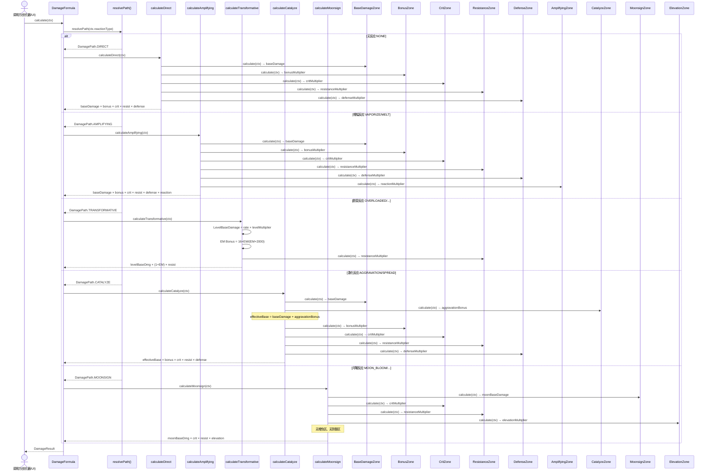
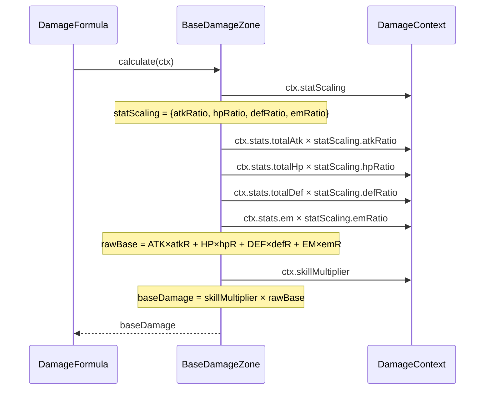
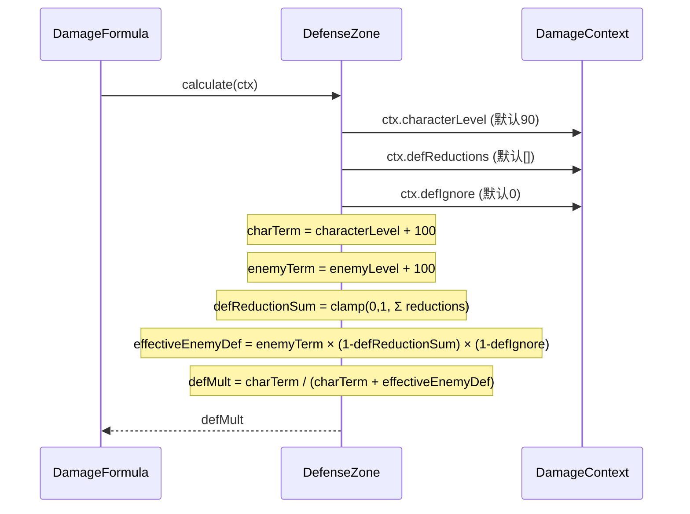
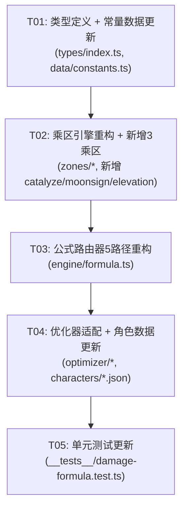

# 增量架构设计：5路径伤害引擎重构

> 本文档描述对现有2路径（增幅/剧变）伤害引擎的增量重构方案，扩展为5路径（直伤/增幅/剧变/激化/月曜）引擎，同时支持多属性缩放和扩展防御区公式。

---

## 一、实现方案

### 1.1 核心技术挑战

| 挑战 | 说明 | 解决方案 |
|------|------|----------|
| 5路径公式路由 | 现有 `DamageFormula.calculate()` 只区分增幅/剧变2条路径，需扩展为5条独立计算路径 | 将路由逻辑从二元分支改为5路分发，每条路径封装为独立方法 |
| 多属性缩放 | 现有 `ScalingType` 枚举只支持 ATK/HP/DEF 单一缩放，需支持 ATK+EM 等混合缩放 | 引入 `StatScaling` 接口替代 `ScalingType` 枚举，Base = Σ(属性值 × 比例) |
| 防御区扩展 | 现有 `DefenseZone` 硬编码 `characterLevel=90`，缺少 `defReduction`/`defIgnore` 参数 | 从 `DamageContext` 读取 `characterLevel`/`defReductions`/`defIgnore`，实现完整公式 |
| 剧变5.2倍率 | 现有常量使用旧值（超载2.0等），需更新为5.2版本（超载2.75等） | 新增 `TRANSFORM_RATES_V52` + `LEVEL_MULTIPLIERS` 查表替代硬编码 |
| 向后兼容 | 优化器等上游使用旧的 `scalingType` 字段构造 `DamageContext` | 保留 `skillMultiplier` 字段，提供 `StatScaling` 的兼容转换函数 |
| 激化/月曜新乘区 | 现有 zone 文件夹缺少激化区、月曜区、擢升区实现 | 新增 `catalyze.ts`、`moonsign.ts`、`elevation.ts` |

### 1.2 架构决策

**决策1：5路径路由采用策略模式**

不使用 switch-case 路由，而是通过 `DamagePath` 枚举 + 路径方法映射表实现。每条路径是一个 `calculateXxxDamage(ctx)` 私有静态方法，由路由入口 `calculate(ctx)` 根据 `DamagePath` 分发。

**决策2：StatScaling 替代 ScalingType**

```typescript
// 旧：ScalingType 枚举
enum ScalingType { ATK, HP, DEF }

// 新：StatScaling 结构
interface StatScaling {
  atkRatio: number;  // 默认 0
  hpRatio: number;   // 默认 0
  defRatio: number;   // 默认 0
  emRatio: number;    // 默认 0
}
```

向后兼容转换：当只有一个 ratio 非零时，等价于旧的单属性缩放。

**决策3：DamageContext 扩展字段**

新增字段全部设置默认值，保证旧的调用代码不 break：
- `characterLevel?: number` — 默认 90
- `defReductions?: number[]` — 默认 `[]`
- `defIgnore?: number` — 默认 0
- `elevationBonus?: number` — 默认 0

**决策4：DamageResult 扩展**

为区分5路径的乘区差异，新增：
- `damagePath: DamagePath` — 标识哪条路径计算
- `aggravationBonus?: number` — 激化加成值
- `elevationMultiplier?: number` — 擢升区乘数

**决策5：剧变常量重构**

旧常量 `TRANSFORMATIVE_BASE_DMG_LEVEL_90` 是预计算好的绝对值，无法支持多等级。新架构改为：
- `TRANSFORM_RATES_V52` — 反应倍率表（2.75/2.0/1.5 等）
- `LEVEL_MULTIPLIERS` — 等级乘数表（lv90=1446.85, lv100=1674.81）
- 剧变基础伤害 = 反应倍率 × 等级乘数

### 1.3 框架与库选型

本次重构不引入新的第三方依赖，全部为 TypeScript 纯函数改造。

---

## 二、文件列表及相对路径

### 2.1 需要修改的文件

| 文件 | 变更类型 | 说明 |
|------|----------|------|
| `src/types/index.ts` | **修改** | 扩展 ReactionType 枚举、新增 DamagePath/StatScaling 类型、扩展 DamageContext/DamageResult/CharacterBuild/CharacterData |
| `src/data/constants.ts` | **修改** | 更新剧变倍率为5.2版本、新增等级乘数表、新增激化/月曜常量、DEFAULT_ENEMY_LEVEL 改为100 |
| `src/engine/zones/base.ts` | **修改** | 从单属性缩放改为多属性缩放（StatScaling），Base = skillMultiplier × Σ(stat × ratio) |
| `src/engine/zones/defense.ts` | **修改** | 从 DamageContext 读取 characterLevel/defReductions/defIgnore，实现完整防御公式 |
| `src/engine/zones/transformative.ts` | **修改** | 使用新的 TRANSFORM_RATES_V52 + LEVEL_MULTIPLIERS 计算剧变基础伤害 |
| `src/engine/zones/amplifying.ts` | **微调** | 增加路径守卫（仅增幅路径调用），保持公式不变 |
| `src/engine/zones/index.ts` | **修改** | 导出新增的3个zone |
| `src/engine/formula.ts` | **重构** | 从2路径改为5路径路由，新增 calculateDirect/calculateCatalyze/calculateMoonsign |
| `src/optimizer/redistribute.ts` | **修改** | 适配新的 DamageContext 构造（使用 statScaling 替代 scalingType） |
| `src/optimizer/ideal.ts` | **修改** | 适配新的 DamageContext 构造 + CharacterData.defaultStatScaling |
| `src/__tests__/damage-formula.test.ts` | **修改** | 新增激化/月曜/直伤/扩展防御区的测试用例 |

### 2.2 需要新增的文件

| 文件 | 说明 |
|------|------|
| `src/engine/zones/catalyze.ts` | 激化区（AggravationBonus = baseRate × levelMult × (1+EM_bonus)） |
| `src/engine/zones/moonsign.ts` | 月曜区（MoonBaseDamage = moonRate × levelMult × (1+EM_bonus)） |
| `src/engine/zones/elevation.ts` | 擢升区（Elevation = 1 + elevationBonus%） |

---

## 三、数据结构和接口

```mermaid
classDiagram
    direction TB

    %% ===== 新增/修改的枚举 =====
    class ReactionType {
        <<enumeration>>
        NONE
        VAPORIZE MELT
        OVERLOADED SUPERCONDUCT ELECTRO_CHARGED
        SWIRL HYPERBLOOM BLOOM BURGEON
        AGGRAVATION SPREAD
        MOON_BLOOM MOON_ELECTRO MOON_CRYSTAL
        REACTION_MOON_ELECTRO REACTION_MOON_CRYSTAL
    }

    class DamagePath {
        <<enumeration>>
        DIRECT
        AMPLIFYING
        TRANSFORMATIVE
        CATALYZE
        MOONSIGN
    }

    class StatScaling {
        <<interface>>
        +number atkRatio
        +number hpRatio
        +number defRatio
        +number emRatio
    }

    %% ===== 修改的接口 =====
    class DamageContext {
        +ComputedStats stats
        +number skillMultiplier
        +StatScaling statScaling
        +ReactionType reactionType
        +number enemyLevel
        +number enemyResistance
        +number amplifyingMultiplier
        +number characterLevel
        +number[] defReductions
        +number defIgnore
        +number elevationBonus
    }

    class DamageResult {
        +number totalDamage
        +number baseDamage
        +number scalingMultiplier
        +number bonusMultiplier
        +number critMultiplier
        +number resistanceMultiplier
        +number defenseMultiplier
        +number reactionMultiplier
        +DamagePath damagePath
        +number aggravationBonus
        +number elevationMultiplier
    }

    class CharacterData {
        +string id
        +string name
        +string nameZh
        +ElementType element
        +WeaponType weaponType
        +BaseStats baseStats
        +AscensionStat ascensionStat
        +SubstatType[] relevantSubstats
        +StatScaling defaultStatScaling
    }

    class CharacterBuild {
        +CharacterData character
        +WeaponData weapon
        +ArtifactInstance[] artifacts
        +number characterLevel
        +number weaponLevel
        +number skillMultiplier
        +ReactionType reactionType
        +TeamBuff[] teamBuffs
        +StatScaling statScaling
    }

    %% ===== 新增乘区 =====
    class CatalyzeZone {
        +calculate~ctx: DamageContext~ number
        +getName() string
    }

    class MoonsignZone {
        +calculate~ctx: DamageContext~ number
        +getName() string
    }

    class ElevationZone {
        +calculate~ctx: DamageContext~ number
        +getName() string
    }

    %% ===== 现有乘区（修改后） =====
    class DamageZone {
        <<abstract>>
        +calculate~ctx: DamageContext~ number*
        +getName() string*
    }

    class BaseDamageZone {
        +calculate~ctx: DamageContext~ number
    }

    class DefenseZone {
        +calculate~ctx: DamageContext~ number
    }

    class TransformativeZone {
        +calculate~ctx: DamageContext~ number
    }

    DamageZone <|-- CatalyzeZone
    DamageZone <|-- MoonsignZone
    DamageZone <|-- ElevationZone
    DamageZone <|-- BaseDamageZone
    DamageZone <|-- DefenseZone
    DamageZone <|-- TransformativeZone

    %% ===== 路由器 =====
    class DamageFormula {
        +calculate~ctx: DamageContext~ DamageResult$
        -calculateDirect~ctx~ DamageResult$
        -calculateAmplifying~ctx~ DamageResult$
        -calculateTransformative~ctx~ DamageResult$
        -calculateCatalyze~ctx~ DamageResult$
        -calculateMoonsign~ctx~ DamageResult$
        -resolvePath~type: ReactionType~ DamagePath$
    }

    DamageFormula --> DamageZone : uses
    DamageFormula --> DamagePath : routes
```



---

## 四、程序调用流程

### 4.1 5路径路由时序图



### 4.2 多属性缩放 BaseDamageZone 计算流程



### 4.3 扩展防御区计算流程



---

## 五、任务列表

### T01: 类型定义 + 常量数据更新

- **依赖**: 无
- **优先级**: P0
- **文件**:
  - `src/types/index.ts`
  - `src/data/constants.ts`
- **描述**:
  1. 在 `ReactionType` 枚举中新增：`AGGRAVATION`、`SPREAD`、`MOON_BLOOM`、`MOON_ELECTRO`、`MOON_CRYSTAL`、`REACTION_MOON_ELECTRO`、`REACTION_MOON_CRYSTAL`
  2. 新增 `DamagePath` 枚举：`DIRECT` / `AMPLIFYING` / `TRANSFORMATIVE` / `CATALYZE` / `MOONSIGN`
  3. 新增 `StatScaling` 接口：`{ atkRatio, hpRatio, defRatio, emRatio }`（全为 number，默认0）
  4. 修改 `DamageContext`：新增 `characterLevel`（默认90）、`defReductions`（默认[]）、`defIgnore`（默认0）、`elevationBonus`（默认0）；将 `scalingType` 替换为 `statScaling: StatScaling`
  5. 修改 `DamageResult`：新增 `damagePath: DamagePath`、`aggravationBonus?: number`、`elevationMultiplier?: number`
  6. 修改 `CharacterData`：将 `defaultScalingType: ScalingType` 替换为 `defaultStatScaling: StatScaling`
  7. 修改 `CharacterBuild`：新增 `statScaling?: StatScaling`（可选，覆盖角色默认值）
  8. 标记 `ScalingType` 枚举为 `@deprecated`，保留但不再新增使用
  9. 在 `constants.ts` 中：
     - 新增 `TRANSFORM_RATES_V52` 常量（超载2.75/感电2.0/超导1.5/碎冰3.0/扩散0.6/绽放2.0/超绽放3.0/烈绽放3.0）
     - 新增 `LEVEL_MULTIPLIERS` 查表（lv90=1446.85, lv100=1674.81）
     - 新增 `AGGRAVATION_BASE_RATES`（超激化=1.15, 蔓激化=1.25）
     - 新增 `MOON_RATES`（月绽放1.0/月感电3.0/月结晶1.6/反应月感电1.8/反应月结晶0.96）
     - 新增 `getAggravationEMBonus(em)` 函数：`5 × EM / (EM + 1200)`
     - 新增 `getMoonsignEMBonus(em)` 函数：`6 × EM / (EM + 2000)`
     - 新增 `getLevelMultiplier(level)` 函数：查 `LEVEL_MULTIPLIERS` 表
     - 修改 `DEFAULT_ENEMY_LEVEL` 从 90 → 100
     - 保留旧 `TRANSFORMATIVE_BASE_DMG_LEVEL_90` 标记为 `@deprecated`
- **验收标准**:
  - TypeScript 编译通过，无类型错误
  - 旧的 `ScalingType` 引用不报错（仅标记 deprecated）
  - 所有新增常量值与 PRD 表格一致

### T02: 乘区引擎重构 + 新增3个乘区

- **依赖**: T01
- **优先级**: P0
- **文件**:
  - `src/engine/zones/base.ts`
  - `src/engine/zones/defense.ts`
  - `src/engine/zones/transformative.ts`
  - `src/engine/zones/amplifying.ts`
  - `src/engine/zones/catalyze.ts`（新增）
  - `src/engine/zones/moonsign.ts`（新增）
  - `src/engine/zones/elevation.ts`（新增）
  - `src/engine/zones/index.ts`
- **描述**:
  1. **重构 `BaseDamageZone`**：
     - 从 `ctx.statScaling` 读取多属性缩放比例
     - `rawBase = stats.totalAtk × scaling.atkRatio + stats.totalHp × scaling.hpRatio + stats.totalDef × scaling.defRatio + stats.em × scaling.emRatio`
     - `baseDamage = ctx.skillMultiplier × rawBase`
     - 当只有一个 ratio 非零时，行为与旧版一致
  2. **重构 `DefenseZone`**：
     - 从 `ctx.characterLevel` 读取角色等级（默认90）
     - 从 `ctx.defReductions` 读取防御削减数组，求和并 clamp(0, 1)
     - 从 `ctx.defIgnore` 读取防御无视比例
     - 实现：`effectiveEnemyDef = (enemyLv+100) × (1-defReductionSum) × (1-defIgnore)`
     - 结果：`charTerm / (charTerm + effectiveEnemyDef)`
  3. **重构 `TransformativeZone`**：
     - 使用 `TRANSFORM_RATES_V52` 替代旧常量
     - 使用 `getLevelMultiplier(ctx.characterLevel)` 替代硬编码 lv90
     - `levelBaseDamage = rate × levelMultiplier`
     - EM bonus 使用 `getTransformativeEMBonus(em)`（已有，不变）
     - 返回 `levelBaseDamage × (1 + emBonus)` 作为乘区乘数
  4. **新增 `CatalyzeZone`**：
     - 计算 `aggravationBonus = baseRate × levelMultiplier × (1 + emBonus)`
     - 其中 `baseRate = AGGRAVATION_BASE_RATES[reactionType]`
     - `emBonus = getAggravationEMBonus(em)` 即 `5 × EM / (EM + 1200)`
     - `levelMultiplier = getLevelMultiplier(characterLevel)`
     - 返回 `aggravationBonus`（加法加到基础伤害中，不是独立乘区）
  5. **新增 `MoonsignZone`**：
     - 计算 `moonBaseDamage = moonRate × levelMultiplier × (1 + emBonus)`
     - 其中 `moonRate = MOON_RATES[reactionType]`
     - `emBonus = getMoonsignEMBonus(em)` 即 `6 × EM / (EM + 2000)`
     - 返回 `moonBaseDamage`（作为月曜路径的基础伤害）
  6. **新增 `ElevationZone`**：
     - 返回 `1 + ctx.elevationBonus`（默认1.0）
  7. **微调 `AmplifyingZone`**：增加路径守卫（仅 AMPLIFYING 路径调用时生效，其他路径返回1.0 — 当前逻辑已经是这样，验证即可）
  8. **更新 `zones/index.ts`**：导出 `CatalyzeZone`、`MoonsignZone`、`ElevationZone`
- **验收标准**:
  - 旧测试全部通过（DamageContext 新字段有默认值）
  - 多属性缩放：`{atkRatio:1, 其余0}` 等价于旧 ATK 缩放
  - 防御区：`defReductions=[0.4], defIgnore=0` 时结果正确（超导场景）
  - 剧变区：超载 lv90 = 2.75 × 1446.85 = 3978.8375

### T03: 公式路由器5路径重构

- **依赖**: T02
- **优先级**: P0
- **文件**:
  - `src/engine/formula.ts`
- **描述**:
  1. 新增 `resolvePath(reactionType)` 静态方法：
     - `NONE` → `DIRECT`
     - `VAPORIZE` / `MELT` → `AMPLIFYING`
     - `OVERLOADED` / `SUPERCONDUCT` / `ELECTRO_CHARGED` / `SWIRL` / `HYPERBLOOM` / `BLOOM` / `BURGEON` → `TRANSFORMATIVE`
     - `AGGRAVATION` / `SPREAD` → `CATALYZE`
     - `MOON_BLOOM` / `MOON_ELECTRO` / `MOON_CRYSTAL` / `REACTION_MOON_ELECTRO` / `REACTION_MOON_CRYSTAL` → `MOONSIGN`
  2. 新增 `calculateDirect(ctx)` 私有静态方法：
     - 调用 Base → Bonus → Crit → Resist → Defense
     - totalDamage = base × bonus × crit × resist × defense
  3. 新增 `calculateAmplifying(ctx)` 私有静态方法（由旧版重构）：
     - 调用 Base → Bonus → Crit → Resist → Defense → AmplifyingZone
     - totalDamage = base × bonus × crit × resist × defense × reaction
  4. 新增 `calculateTransformative(ctx)` 私有静态方法（由旧版重构）：
     - 调用 TransformativeZone → Resist
     - totalDamage = moonBaseDmg × (1+emBonus) × resist
  5. 新增 `calculateCatalyze(ctx)` 私有静态方法：
     - 调用 Base → CatalyzeZone → Bonus → Crit → Resist → Defense
     - effectiveBase = baseDamage + aggravationBonus
     - totalDamage = effectiveBase × bonus × crit × resist × defense
  6. 新增 `calculateMoonsign(ctx)` 私有静态方法：
     - 调用 MoonsignZone → Crit → Resist → ElevationZone
     - totalDamage = moonBaseDmg × crit × resist × elevation
     - **注意**：无 Bonus 区、无 Defense 区
  7. 修改 `calculate(ctx)` 入口：
     - 调用 `resolvePath(ctx.reactionType)` 确定路径
     - 分发到对应的私有方法
     - 在返回的 `DamageResult` 中填充 `damagePath`、`aggravationBonus`、`elevationMultiplier`
  8. 删除旧的 `isTransformativeReaction()` 顶层函数，路由逻辑统一由 `resolvePath` 管理
- **验收标准**:
  - 所有5条路径均有正确的乘区组合
  - 直伤路径：无反应乘区
  - 增幅路径：与旧版结果一致（回归测试）
  - 剧变路径：跳过暴击/增伤/防御/技能倍率
  - 激化路径：aggravationBonus 叠加到 baseDamage
  - 月曜路径：有暴击和擢升区，无增伤和防御区

### T04: 优化器适配 + 角色数据更新

- **依赖**: T03
- **优先级**: P0
- **文件**:
  - `src/optimizer/redistribute.ts`
  - `src/optimizer/ideal.ts`
  - `src/data/characters/hu_tao.json`
  - `src/data/characters/raiden_shogun.json`
  - `src/data/characters/zhong_li.json`
  - `src/data/characters/ganyu.json`
  - `src/data/characters/navilette.json`
- **描述**:
  1. **修改 `redistribute.ts`**：
     - 将 `evaluateDamage()` 和 `evaluateDamageWithBreakdown()` 中的 `DamageContext` 构造改为使用 `statScaling`
     - `statScaling` 来源：`build.statScaling ?? build.character.defaultStatScaling`
     - 新增 `characterLevel`（从 `build.characterLevel` 读取）
     - 新增 `defReductions`（默认 `[]`）、`defIgnore`（默认0）、`elevationBonus`（默认0）
     - `enemyLevel` 改为使用新的 `DEFAULT_ENEMY_LEVEL`（100）
  2. **修改 `ideal.ts`**：
     - 同上适配 `DamageContext` 构造
     - `createReferenceBuild()` 中的 Sands 主词条选择逻辑改为读取 `defaultStatScaling` 判断主要缩放属性
  3. **更新角色 JSON 数据**：
     - 将 `defaultScalingType` 替换为 `defaultStatScaling`
     - 胡桃：`{ hpRatio: 1, atkRatio: 0, defRatio: 0, emRatio: 0 }`
     - 雷电将军：`{ atkRatio: 1, hpRatio: 0, defRatio: 0, emRatio: 0 }`
     - 钟离：`{ hpRatio: 1, atkRatio: 0, defRatio: 0, emRatio: 0 }`（或 DEF 根据具体技能）
     - 甘雨：`{ atkRatio: 1, hpRatio: 0, defRatio: 0, emRatio: 0 }`
     - 那维莱特：`{ hpRatio: 1, atkRatio: 0, defRatio: 0, emRatio: 0 }`
- **验收标准**:
  - 所有角色 JSON 加载无报错
  - 优化器对胡桃的优化结果与重构前一致（回归）
  - `enemyLevel` 默认值已改为100

### T05: 单元测试更新

- **依赖**: T04
- **优先级**: P0
- **文件**:
  - `src/__tests__/damage-formula.test.ts`
- **描述**:
  1. 更新 `makeCtx()` helper：使用 `statScaling` 替代 `scalingType`，设置新的默认字段
  2. 验证旧测试在新的 `DamageContext` 下仍然通过
  3. 新增测试：
     - **多属性缩放**：`{atkRatio:0.5, emRatio:0.5}` 时 baseDamage 计算正确
     - **直伤路径**：`ReactionType.NONE` → `DamagePath.DIRECT`，无反应乘区
     - **扩展防御区**：`defReductions=[0.4]` 时防御乘数降低（超导场景）；`defIgnore=0.6` 时（雷电C2场景）
     - **激化路径**：超激化 `AGGRAVATION` → `DamagePath.CATALYZE`，aggravationBonus 叠加到 baseDamage
     - **蔓激化路径**：`SPREAD` 路径正确
     - **月曜路径**：`MOON_BLOOM` → `DamagePath.MOONSIGN`，无增伤区、无防御区、有暴击和擢升区
     - **擢升区**：`elevationBonus=0.3` 时乘数为1.3
     - **剧变5.2倍率**：超载 lv90 = 2.75 × 1446.85 × (1+emBonus)
     - **默认敌人等级**：新的 DEFAULT_ENEMY_LEVEL = 100
  4. 边界测试：`defReductions` 总和超过1.0 时 clamp 为1.0
- **验收标准**:
  - 全部测试通过 `npx vitest run`
  - 新增测试覆盖所有5条路径
  - 旧测试无回归

---

## 六、依赖包列表

本次重构**不引入新的第三方依赖**。所有改动为纯 TypeScript 逻辑重构。

```
# 无新增依赖
# 现有依赖不变：
- react@^18.3.1
- typescript@^5.5.4
- vitest@^2.0.0 (dev, 测试)
- comlink@^4.4.1 (Worker通信)
```

---

## 七、共享知识

### 7.1 百分比存储规则（不变）

所有百分比内部存储为小数（如 50% → 0.5），UI展示时转换。新增的 `StatScaling` 中的 ratio 同样遵循此规则：
- `atkRatio: 1` 表示 ATK × 100%
- `atkRatio: 0.5, emRatio: 0.5` 表示 ATK × 50% + EM × 50%

### 7.2 5路径乘区矩阵

| 乘区 | 直伤 | 增幅 | 剧变 | 激化 | 月曜 |
|------|------|------|------|------|------|
| Base（多属性缩放） | ✅ | ✅ | ❌ | ✅ | ❌ |
| Scaling（skillMultiplier） | ✅ | ✅ | ❌ | ✅ | ❌ |
| Bonus（增伤区） | ✅ | ✅ | ❌ | ✅ | ❌ |
| Crit（暴击区） | ✅ | ✅ | ❌ | ✅ | ✅ |
| Resistance（抗性区） | ✅ | ✅ | ✅ | ✅ | ✅ |
| Defense（防御区） | ✅ | ✅ | ❌ | ✅ | ❌ |
| Amplifying（增幅区） | ❌ | ✅ | ❌ | ❌ | ❌ |
| Transformative（剧变区） | ❌ | ❌ | ✅ | ❌ | ❌ |
| Catalyze（激化加成→叠加到base） | ❌ | ❌ | ❌ | ✅ | ❌ |
| Moonsign（月曜基础伤害） | ❌ | ❌ | ❌ | ❌ | ✅ |
| Elevation（擢升区） | ❌ | ❌ | ❌ | ❌ | ✅ |

### 7.3 DamageContext 向后兼容规则

新增字段全部有默认值：
- `characterLevel`: 默认 90（从 `CharacterBuild.characterLevel` 传入，或默认90）
- `defReductions`: 默认 `[]`
- `defIgnore`: 默认 0
- `elevationBonus`: 默认 0
- `statScaling`: 替代 `scalingType`，从 `CharacterData.defaultStatScaling` 传入

### 7.4 EM加成公式速查

| 路径 | EM加成公式 |
|------|-----------|
| 增幅 | 2.78 × EM / (EM + 1400) |
| 剧变 | 16 × EM / (EM + 2000) |
| 激化 | 5 × EM / (EM + 1200) |
| 月曜 | 6 × EM / (EM + 2000) |

### 7.5 路由函数 resolvePath 规则

```typescript
function resolvePath(type: ReactionType): DamagePath {
  if (type === ReactionType.NONE) return DamagePath.DIRECT;
  if (type === ReactionType.VAPORIZE || type === ReactionType.MELT) return DamagePath.AMPLIFYING;
  if ([ReactionType.OVERLOADED, ReactionType.SUPERCONDUCT, ReactionType.ELECTRO_CHARGED,
       ReactionType.SWIRL, ReactionType.HYPERBLOOM, ReactionType.BLOOM, ReactionType.BURGEON
      ].includes(type)) return DamagePath.TRANSFORMATIVE;
  if (type === ReactionType.AGGRAVATION || type === ReactionType.SPREAD) return DamagePath.CATALYZE;
  if ([ReactionType.MOON_BLOOM, ReactionType.MOON_ELECTRO, ReactionType.MOON_CRYSTAL,
       ReactionType.REACTION_MOON_ELECTRO, ReactionType.REACTION_MOON_CRYSTAL
      ].includes(type)) return DamagePath.MOONSIGN;
  return DamagePath.DIRECT; // fallback
}
```

---

## 八、任务依赖关系图



---

## 九、待明确事项

| 编号 | 事项 | 影响范围 | 当前假设 |
|------|------|----------|----------|
| U1 | 月曜反应擢升区加成的具体来源清单是否完整（6.x版本更新中） | 月曜路径数值精度 | 先按单一 `elevationBonus` 字段实现，预留多来源累加扩展 |
| U2 | 反应月曜（反应月感电1.8/反应月结晶0.96）的"触发角色队伍加权"机制 | 反应月曜计算准确性 | 先按固定倍率实现，待版本更新后补充加权逻辑 |
| U3 | 等级乘数表目前只有 lv90 和 lv100 两个数据点，是否需要更多等级 | `LEVEL_MULTIPLIERS` 查表范围 | 先支持 lv1~100 的整数等级，缺失等级用最近等级插值或报错 |
| U4 | `ScalingType` 枚举何时彻底移除 | 向后兼容期 | 本版本标记 `@deprecated`，下个大版本移除 |
| U5 | 剧变5.2倍率更新后，旧测试中硬编码的旧值（如 OVERLOADED=2172）需要同步更新 | 测试回归 | 旧测试全部更新为新常量计算值 |
| U6 | `StatScaling` 中所有 ratio 都为0的边界情况 | BaseDamageZone | 返回 baseDamage=0（合理：无缩放属性 = 无伤害） |
