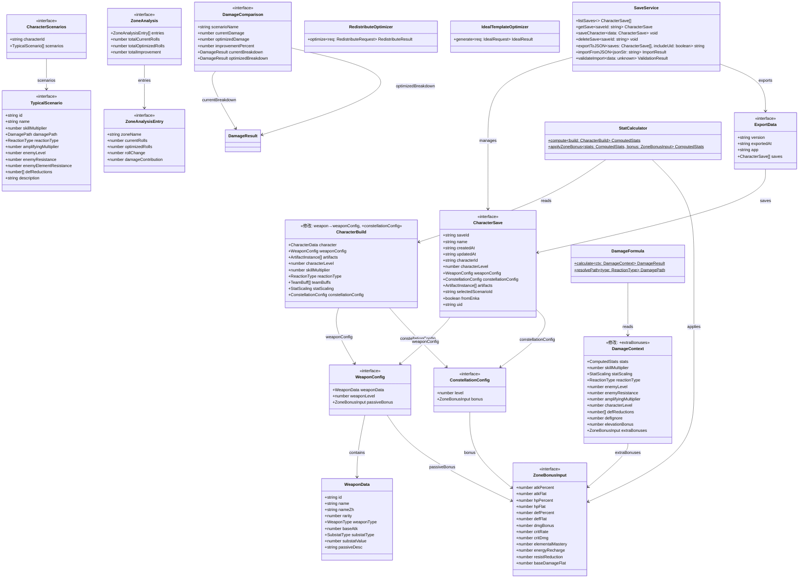
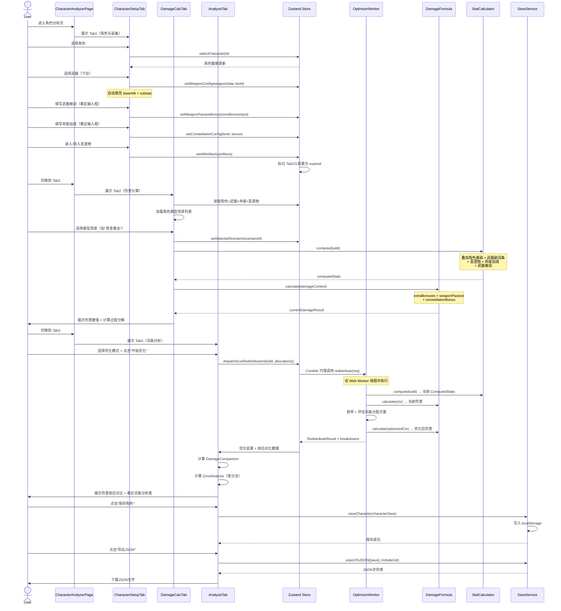
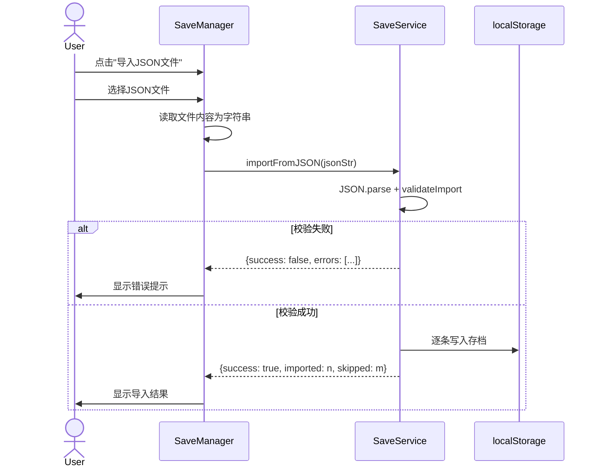
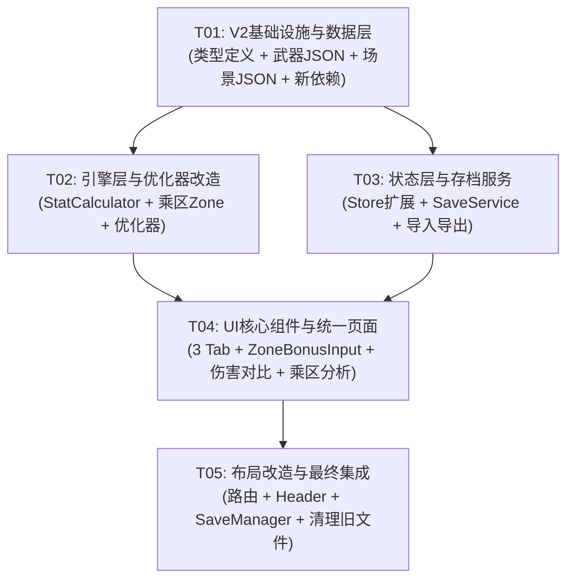

# 原神圣遗物词条优化器 V2 — 系统架构设计文档

## 一、实现方案与框架选型

### 1.1 V1 → V2 核心变更概述

| 变更项 | V1 现状 | V2 目标 |
|---|---|---|
| 页面结构 | 侧边栏导航 + 两个独立页面（RedistributePage / IdealTemplatePage） | 单页面 + 3个Tab标签页（角色与装备 / 伤害计算 / 词条分析） |
| 武器 | 硬编码5把武器的 `weapons.ts` + `DEFAULT_WEAPON` 占位 | 按类型分目录的武器JSON + 下拉选择自动填充 + 被动手动填乘区 |
| 命座 | 无 | 用户手动填写各乘区加成（ZoneBonusInput） |
| 典型场景 | 用户手动输入技能倍率/反应类型/敌人参数 | 预设场景JSON，每角色2-3个，一键选择 |
| 伤害对比 | 仅展示优化后伤害 | 优化前后伤害数值对比 + 差值/提升百分比 |
| 乘区分析 | 无 | 表格展示各乘区词条变化及对伤害的贡献 |
| 存档系统 | 无 | localStorage + JSON导入导出 + UID隐私选项 |
| 属性计算 | StatCalculator 不支持额外加成 | 支持 ZoneBonusInput（武器被动 + 命座）叠加到各乘区 |
| 布局 | 左侧固定Sidebar + 右侧内容区 | 顶部标题栏（含存档管理）+ 主内容区 |

### 1.2 核心技术挑战

| 挑战 | 说明 | 解决方案 |
|---|---|---|
| 页面合并与数据联动 | 两个独立页面的状态和逻辑合并到单页面3个Tab，Tab间数据需联动 | 统一 Zustand Store 管理，Tab切换时从同一Store读取；Tab1数据变更标记Tab2/3结果为「已过期」 |
| ZoneBonusInput 叠加计算 | 武器被动/命座的额外加成需正确叠加到各乘区，且不替换已有值 | StatCalculator 新增 `extraBonuses: ZoneBonusInput` 参数，在已有基础上累加；DamageContext 也传递此参数给各乘区 |
| 乘区词条分析 | 需计算每个乘区词条变化对总伤害的贡献 | 冻结其他乘区，单独调整该乘区词条至优化值，差分法计算贡献 |
| 武器数据结构化 | 从硬编码数组迁移到JSON配置文件，支持按武器类型过滤 | 新建 `src/data/weapons/` 目录，参照 `src/data/characters/` 的 `import.meta.glob` 模式 |
| 存档系统 | localStorage读写 + JSON导入导出 + 格式校验 + 版本兼容 | 新建 SaveService，统一管理 localStorage key 命名空间；JSON校验使用 TypeScript 类型守卫 |

### 1.3 框架选型（沿用V1）

V2 沿用 V1 全部技术栈，不引入新框架：

| 类别 | 选型 | 版本 | 说明 |
|---|---|---|---|
| 构建工具 | Vite | ^5.4.0 | 不变 |
| UI 框架 | React | ^18.3.0 | 不变 |
| 组件库 | MUI | ^6.1.0 | 不变，新增 Tabs/Tab 组件 |
| 样式方案 | Tailwind CSS | ^3.4.0 | 不变 |
| 状态管理 | Zustand | ^5.0.0 | 不变，新增 saveSlice |
| 路由 | React Router | ^6.26.0 | 简化路由（单页面） |
| 图表 | Recharts | ^2.12.0 | 不变 |
| Worker 通信 | Comlink | ^4.4.0 | 不变 |
| 新增依赖 | uuid | ^9.0.0 | 存档ID生成 |

### 1.4 架构模式

沿用 V1 的 **模块化管道架构**，新增以下层次：

```
┌──────────────────────────────────────────────────────────────────┐
│                        UI Layer (React)                          │
│  ┌────────────────────────────────────────────────────────────┐  │
│  │          CharacterAnalyzerPage（统一页面 + 3 Tab）           │  │
│  │  ┌──────────┐  ┌──────────────┐  ┌───────────────┐        │  │
│  │  │ Tab1:    │  │ Tab2:       │  │ Tab3:        │        │  │
│  │  │角色与装备│  │ 伤害计算     │  │ 词条分析     │        │  │
│  │  └─────┬────┘  └──────┬──────┘  └───────┬───────┘        │  │
│  └────────┼──────────────┼─────────────────┼─────────────────┘  │
│           └──────────────┼─────────────────┘                     │
│                          │                                        │
│  ┌───────────────────────▼──────────────────────────┐           │
│  │              Zustand Store (状态管理)               │           │
│  │  characterSlice | artifactSlice | optimizerSlice  │           │
│  │                    | saveSlice |                  │           │
│  └───────────────────────┬──────────────────────────┘           │
├──────────────────────────┼──────────────────────────────────────┤
│                    Service Layer                                  │
│  ┌──────────────┐  ┌───▼───┐  ┌──────────────┐                 │
│  │ EnkaService  │  │ Store │  │ SaveService  │                 │
│  └──────────────┘  └───┬───┘  └──────────────┘                 │
│                       │                                           │
├───────────────────────┼──────────────────────────────────────────┤
│                  Engine Layer (纯函数)                             │
│  ┌────────────────────▼──────────────────────┐                  │
│  │    DamageFormula (伤害公式管道 + ZoneBonus) │                  │
│  │  ┌──────┐ ┌────────┐ ┌──────┐ ┌──────┐   │                  │
│  │  │基础区│→│增伤区   │→│暴击区│→│抗性区│   │                  │
│  │  └──────┘ └────────┘ └──────┘ └──────┘   │                  │
│  │  ┌──────┐ ┌────────┐ ┌──────┐             │                  │
│  │  │防御区│→│反应区   │→│...   │             │                  │
│  │  └──────┘ └────────┘ └──────┘             │                  │
│  └────────────────────────────────────────────┘                  │
│                                                                   │
│  ┌────────────────────────────────────────────┐                  │
│  │          Optimizer (Web Worker)             │                  │
│  │  ┌──────────────┐  ┌──────────────────┐    │                  │
│  │  │ 重分配优化器  │  │ 理想模板优化器    │    │                  │
│  │  └──────────────┘  └──────────────────┘    │                  │
│  └────────────────────────────────────────────┘                  │
├───────────────────────────────────────────────────────────────────┤
│                    Data Layer (JSON 配置)                          │
│  ┌───────────┐  ┌───────────┐  ┌─────────────┐                  │
│  │ 角色数据   │  │ 武器数据   │  │ 场景数据     │                  │
│  └───────────┘  └───────────┘  └─────────────┘                  │
└───────────────────────────────────────────────────────────────────┘
```

**关键设计决策：**

1. **ZoneBonusInput 作为统一额外加成接口**：武器被动和命座共用 `ZoneBonusInput` 类型，在 StatCalculator 和 DamageContext 中统一叠加，减少重复逻辑
2. **CharacterBuild 扩展**：新增 `weaponConfig: WeaponConfig`（含 passiveBonus）和 `constellationConfig: ConstellationConfig`（含 bonus），替代原来的 `weapon: WeaponData`
3. **典型场景数据驱动**：每角色独立 JSON 文件，通过 `import.meta.glob` 加载，与角色数据解耦
4. **存档独立服务**：SaveService 封装 localStorage CRUD + JSON 导入导出 + 格式校验，不与 CacheService 混用
5. **页面合并策略**：删除 RedistributePage 和 IdealTemplatePage，新建 CharacterAnalyzerPage 内含3个Tab组件；旧组件逻辑拆分到各Tab中

---

## 二、文件列表及相对路径

### 2.1 新增文件

```
src/
├── types/
│   └── index.ts                              # 修改：新增 ZoneBonusInput, WeaponConfig, ConstellationConfig, TypicalScenario, CharacterScenarios, DamageComparison, ZoneAnalysisEntry, ZoneAnalysis, CharacterSave, ExportData
│
├── data/
│   ├── weapons/
│   │   ├── index.ts                          # 新建：武器数据索引 & 加载器（import.meta.glob）
│   │   ├── staff_of_homa.json                # 新建：护摩之杖
│   │   ├── engulfing_lightning.json          # 新建：薙草之稻光
│   │   ├── black_tassel.json                 # 新建：黑缨枪
│   │   ├── epitome_of_knowledge.json         # 新建：万世流涌大典
│   │   ├── amos_bow.json                     # 新建：阿莫斯之弓
│   │   └── ...                               # 其他武器JSON
│   ├── scenarios/
│   │   ├── index.ts                          # 新建：场景数据索引 & 加载器
│   │   ├── hu_tao.json                       # 新建：胡桃典型场景
│   │   ├── raiden_shogun.json                # 新建：雷电将军典型场景
│   │   ├── ganyu.json                        # 新建：甘雨典型场景
│   │   ├── zhong_li.json                     # 新建：钟离典型场景
│   │   └── neuvillette.json                  # 新建：那维莱特典型场景
│   └── weapons.ts                            # 修改：标记为deprecated，指向 weapons/index.ts
│
├── engine/
│   ├── stats.ts                              # 修改：支持 ZoneBonusInput 叠加
│   ├── formula.ts                            # 修改：DamageContext 传递 extraBonuses
│   └── zones/
│       ├── base.ts                           # 修改：读取 baseDamageFlat
│       ├── bonus.ts                          # 修改：读取 dmgBonus
│       ├── crit.ts                           # 修改：读取 critRate/critDmg
│       ├── resistance.ts                     # 修改：读取 resistReduction
│       ├── defense.ts                        # 修改：读取 defPercent/defFlat
│       └── amplifying.ts                     # 修改：读取 elementalMastery
│
├── optimizer/
│   ├── redistribute.ts                       # 修改：支持 ZoneBonusInput
│   ├── ideal.ts                              # 修改：支持 ZoneBonusInput
│   └── worker.ts                             # 修改：更新 API 参数
│
├── store/
│   └── slices/
│       ├── characterSlice.ts                 # 修改：新增武器配置、命座配置、场景选择
│       ├── artifactSlice.ts                  # 修改：可能微调
│       ├── optimizerSlice.ts                 # 修改：新增 DamageComparison + ZoneAnalysis 结果
│       └── saveSlice.ts                      # 新建：存档管理（CRUD + 导入导出）
│
├── services/
│   ├── save.ts                               # 新建：SaveService（localStorage + JSON导入导出 + 格式校验）
│   └── cache.ts                              # 不变
│
├── components/
│   ├── layout/
│   │   ├── AppLayout.tsx                     # 修改：去掉Sidebar，加顶部标题栏
│   │   ├── Sidebar.tsx                       # 删除（或标记deprecated）
│   │   ├── Header.tsx                        # 新建：顶部标题栏 + 存档管理入口
│   │   └── SaveManager.tsx                   # 新建：存档管理弹窗（列表/重命名/删除/导入/导出）
│   ├── common/
│   │   ├── ZoneBonusInput.tsx                # 新建：乘区加成输入组件（按乘区分组输入框，武器被动/命座共用）
│   │   ├── StatInput.tsx                     # 不变
│   │   ├── StatDisplay.tsx                   # 不变
│   │   ├── DamageResult.tsx                  # 不变
│   │   └── LoadingOverlay.tsx                # 不变
│   ├── weapon/
│   │   ├── WeaponSelect.tsx                  # 修改：下拉选择 + 按角色武器类型过滤 + 自动填充
│   │   └── WeaponPassiveInput.tsx            # 新建：武器被动效果输入（复用ZoneBonusInput）
│   ├── character/
│   │   ├── CharacterSelect.tsx               # 不变
│   │   ├── CharacterStats.tsx                # 不变
│   │   ├── SkillInput.tsx                    # 不变
│   │   └── ConstellationInput.tsx            # 新建：命座等级选择 + 乘区加成输入（复用ZoneBonusInput）
│   ├── optimizer/
│   │   ├── CharacterAnalyzerPage.tsx         # 新建：统一角色分析页面（3 Tab 容器）
│   │   ├── CharacterSetupTab.tsx             # 新建：Tab1 - 角色与装备录入
│   │   ├── DamageCalcTab.tsx                 # 新建：Tab2 - 伤害计算（典型场景 + 计算过程）
│   │   ├── AnalysisTab.tsx                   # 新建：Tab3 - 词条分析与方案（优化 + 对比 + 乘区分析）
│   │   ├── ScenarioSelect.tsx                # 新建：典型场景选择组件
│   │   ├── DamageComparison.tsx              # 新建：伤害前后对比展示组件
│   │   ├── ZoneAnalysisTable.tsx             # 新建：乘区词条分析表组件
│   │   ├── OptimizationResult.tsx            # 不变
│   │   └── ComparisonChart.tsx               # 不变
│   ├── artifact/
│   │   ├── ArtifactEditor.tsx                # 不变
│   │   ├── ArtifactImport.tsx                # 不变
│   │   └── ArtifactList.tsx                  # 不变
│   └── ...
│
├── App.tsx                                   # 修改：路由简化为单页面
└── pages/
    └── HomePage.tsx                          # 修改：重定向到角色分析页
```

### 2.2 删除/废弃文件

| 文件 | 处置 | 原因 |
|---|---|---|
| `src/components/optimizer/RedistributePage.tsx` | 删除 | 逻辑合并到 CharacterSetupTab + AnalysisTab |
| `src/components/optimizer/IdealTemplatePage.tsx` | 删除 | 逻辑合并到 AnalysisTab |
| `src/components/layout/Sidebar.tsx` | 删除 | V2 改为顶部导航，无侧边栏 |
| `src/data/weapons.ts` | 标记 @deprecated | 迁移到 `src/data/weapons/` 目录 |

---

## 三、数据结构和接口（类图）



---

## 四、程序调用流程（时序图）

### 4.1 V2 统一工作流：角色录入 → 伤害计算 → 词条分析



### 4.2 存档导入流程



---

## 五、任务列表

### Task 01: V2 基础设施与数据层

- **任务ID**: T01
- **优先级**: P0
- **前置依赖**: 无
- **涉及文件**:
  - `src/types/index.ts`（修改：新增 ZoneBonusInput, WeaponConfig, ConstellationConfig, TypicalScenario, CharacterScenarios, DamageComparison, ZoneAnalysisEntry, ZoneAnalysis, CharacterSave, ExportData；修改 WeaponData 增加 weaponType 字段；修改 CharacterBuild 增加 weaponConfig 和 constellationConfig）
  - `src/data/weapons/index.ts`（新建：武器数据索引 & 加载器）
  - `src/data/weapons/staff_of_homa.json`（新建）
  - `src/data/weapons/engulfing_lightning.json`（新建）
  - `src/data/weapons/black_tassel.json`（新建）
  - `src/data/weapons/epitome_of_knowledge.json`（新建）
  - `src/data/weapons/amos_bow.json`（新建）
  - `src/data/scenarios/index.ts`（新建：场景数据索引 & 加载器）
  - `src/data/scenarios/hu_tao.json`（新建）
  - `src/data/scenarios/raiden_shogun.json`（新建）
  - `src/data/scenarios/ganyu.json`（新建）
  - `src/data/scenarios/zhong_li.json`（新建）
  - `src/data/scenarios/neuvillette.json`（新建）
  - `package.json`（修改：新增 uuid 依赖）
  - `src/data/weapons.ts`（修改：标记 @deprecated，指向新目录）
- **描述**:
  - 在 `src/types/index.ts` 中新增 V2 所需的所有类型定义，特别是 `ZoneBonusInput`（核心共享接口）、`WeaponConfig`、`ConstellationConfig`、`TypicalScenario`、`CharacterScenarios`、`DamageComparison`、`ZoneAnalysisEntry`、`ZoneAnalysis`、`CharacterSave`、`ExportData`
  - 修改 `WeaponData` 接口增加 `weaponType: WeaponType` 字段，用于按武器类型过滤
  - 修改 `CharacterBuild` 接口：将 `weapon: WeaponData` 替换为 `weaponConfig: WeaponConfig`，新增 `constellationConfig: ConstellationConfig`
  - 新建 `src/data/weapons/` 目录，将 `weapons.ts` 中的5把武器数据迁移到独立 JSON 文件，每文件增加 `weaponType` 字段
  - 新建 `src/data/weapons/index.ts`，使用 `import.meta.glob` 加载所有武器 JSON，提供 `getWeaponById`、`getWeaponsByType`、`getAllWeapons` 函数
  - 新建 `src/data/scenarios/` 目录，为现有5个角色各创建典型场景 JSON（每角色2-3个场景）
  - 新建 `src/data/scenarios/index.ts`，使用 `import.meta.glob` 加载所有场景 JSON，提供 `getScenariosByCharacterId` 函数
  - `package.json` 新增 `uuid` 依赖

### Task 02: 引擎层与优化器改造

- **任务ID**: T02
- **优先级**: P0
- **前置依赖**: T01
- **涉及文件**:
  - `src/engine/stats.ts`（修改：新增 `applyZoneBonus` 方法，将 ZoneBonusInput 叠加到 ComputedStats）
  - `src/engine/formula.ts`（修改：DamageContext 增加 `extraBonuses: ZoneBonusInput` 字段，默认空对象）
  - `src/engine/zones/base.ts`（修改：从 `ctx.extraBonuses.baseDamageFlat` 读取额外基础伤害加成）
  - `src/engine/zones/bonus.ts`（修改：从 `ctx.extraBonuses.dmgBonus` 读取额外增伤加成）
  - `src/engine/zones/crit.ts`（修改：从 `ctx.extraBonuses.critRate/critDmg` 读取额外暴击加成）
  - `src/engine/zones/resistance.ts`（修改：从 `ctx.extraBonuses.resistReduction` 读取额外减抗）
  - `src/engine/zones/defense.ts`（修改：从 `ctx.extraBonuses.defPercent/defFlat` 读取额外防御加成）
  - `src/engine/zones/amplifying.ts`（修改：从 `ctx.extraBonuses.elementalMastery` 读取额外精通加成）
  - `src/optimizer/redistribute.ts`（修改：请求参数适配新的 CharacterBuild 结构，传递 ZoneBonusInput）
  - `src/optimizer/ideal.ts`（修改：请求参数适配新结构）
  - `src/optimizer/worker.ts`（修改：API 参数类型更新，适配 CharacterBuild 变更）
- **描述**:
  - **StatCalculator 改造**：
    - `compute(build)` 方法适配 `WeaponConfig`（从 `weaponData` 读取 baseAtk/substat，从 `passiveBonus` 读取被动加成）
    - 新增 `applyZoneBonus(stats: ComputedStats, bonus: ZoneBonusInput): ComputedStats` 静态方法，将 ZoneBonusInput 的各字段叠加到对应属性上
    - 在 `compute` 中调用 `applyZoneBonus` 分别叠加武器被动和命座加成
  - **DamageContext 扩展**：新增 `extraBonuses: ZoneBonusInput` 字段，构建 DamageContext 时合并武器被动 + 命座加成
  - **各乘区 Zone 改造**：在 `calculate(ctx)` 中读取 `ctx.extraBonuses` 对应字段并叠加
  - **优化器改造**：`RedistributeRequest` 和 `IdealRequest` 适配新的 `CharacterBuild` 结构（含 WeaponConfig 和 ConstellationConfig），确保优化计算中正确传递额外加成

### Task 03: 状态层与存档服务

- **任务ID**: T03
- **优先级**: P0
- **前置依赖**: T01
- **涉及文件**:
  - `src/store/slices/characterSlice.ts`（修改：新增 weaponConfig、constellationConfig、selectedScenarioId 状态及对应 actions）
  - `src/store/slices/optimizerSlice.ts`（修改：新增 damageComparison、zoneAnalysis 结果状态；新增 runOptimizationWithComparison action）
  - `src/store/slices/saveSlice.ts`（新建：存档管理状态 + actions：listSaves, loadSave, saveCurrent, deleteSave, exportSaves, importSaves）
  - `src/services/save.ts`（新建：SaveService 类 — localStorage CRUD、JSON 导入导出、格式校验、版本兼容、UID隐私处理）
- **描述**:
  - **characterSlice 扩展**：
    - 新增状态：`weaponConfig: WeaponConfig | null`、`constellationConfig: ConstellationConfig`（默认 `{level: 0, bonus: {}}`）、`selectedScenarioId: string | null`、`isResultExpired: boolean`
    - 新增 actions：`setWeaponConfig`、`setWeaponPassiveBonus`、`setConstellationConfig`、`setConstellationBonus`、`setSelectedScenario`、`markResultExpired`
    - 选择角色时自动设置默认武器配置（根据角色 weaponType 过滤武器列表，选择第一把）
  - **optimizerSlice 扩展**：
    - 新增状态：`damageComparison: DamageComparison | null`、`zoneAnalysis: ZoneAnalysis | null`
    - 新增 action：`runOptimizationWithComparison`，在优化完成后自动计算 DamageComparison 和 ZoneAnalysis
    - ZoneAnalysis 计算逻辑：冻结其他乘区，单独调整某乘区词条数至优化值，计算伤害差值作为该乘区贡献
  - **saveSlice 新建**：
    - 状态：`saves: CharacterSave[]`、`currentSaveId: string | null`、`importError: string | null`
    - Actions：`listSaves`（从 SaveService 加载）、`loadSave`（从存档恢复所有 slice 状态）、`saveCurrent`（收集各 slice 状态写入存档）、`deleteSave`、`exportSaves`、`importSaves`
  - **SaveService 新建**：
    - localStorage key 前缀：`gao_save_`
    - `listSaves()`: 遍历 localStorage 匹配前缀，反序列化
    - `getSave(saveId)`: 单条读取
    - `saveCharacter(data)`: 写入单条存档
    - `deleteSave(saveId)`: 删除单条
    - `exportToJSON(saves, includeUid)`: 构建 ExportData 结构，若 `includeUid=false` 则删除 uid 字段，JSON.stringify 返回
    - `importFromJSON(jsonStr)`: JSON.parse → validateImport → 逐条 saveCharacter
    - `validateImport(data)`: 校验 version 字段存在且主版本号兼容、saves 为非空数组、每条 save 的 characterId 存在于角色数据库

### Task 04: UI 核心组件与统一页面

- **任务ID**: T04
- **优先级**: P0
- **前置依赖**: T02, T03
- **涉及文件**:
  - `src/components/optimizer/CharacterAnalyzerPage.tsx`（新建：统一页面容器，3个Tab + 顶部标题 + 存档按钮）
  - `src/components/optimizer/CharacterSetupTab.tsx`（新建：Tab1 — 角色选择、武器选择+被动输入、命座输入、圣遗物录入/导入，合并原 RedistributePage 和 IdealTemplatePage 的录入部分）
  - `src/components/optimizer/DamageCalcTab.tsx`（新建：Tab2 — 典型场景选择、当前配置伤害计算 + 过程分解展示）
  - `src/components/optimizer/AnalysisTab.tsx`（新建：Tab3 — 优化控制、伤害前后对比、乘区词条分析表、词条分配详情，合并原 RedistributePage 和 IdealTemplatePage 的结果部分）
  - `src/components/common/ZoneBonusInput.tsx`（新建：按乘区分组的输入框组件，7个乘区各有输入框，百分比字段带 `%` 后缀，固定值字段带单位提示，支持 tooltip 提示；武器被动和命座共用此组件）
  - `src/components/weapon/WeaponSelect.tsx`（改造：按角色武器类型过滤 + 下拉搜索 + 选择后自动填充 baseAtk/substat 到 store）
  - `src/components/weapon/WeaponPassiveInput.tsx`（新建：包装 ZoneBonusInput，标题为"武器被动效果"，带 passiveDesc 提示）
  - `src/components/character/ConstellationInput.tsx`（新建：命座等级下拉(0-6) + ZoneBonusInput，标题为"命座加成"）
  - `src/components/optimizer/ScenarioSelect.tsx`（新建：典型场景单选列表 + 场景参数展示）
  - `src/components/optimizer/DamageComparison.tsx`（新建：当前伤害 vs 优化后伤害 + 差值 + 提升百分比，大字展示）
  - `src/components/optimizer/ZoneAnalysisTable.tsx`（新建：乘区词条分析表 — 乘区名 | 当前词条 | 优化后词条 | 变化 | 伤害贡献）
- **描述**:
  - **CharacterAnalyzerPage**：使用 MUI Tabs 组件，3个 TabPanel；顶部标题栏含"保存角色"按钮和存档管理入口；Tab切换时若 `isResultExpired` 则提示"数据已更新，请重新计算"
  - **CharacterSetupTab**：从原 RedistributePage 和 IdealTemplatePage 的录入部分抽取，整合为：角色选择 + 等级 → 武器选择 + 被动输入 → 命座输入 → 圣遗物（复用 ArtifactImport + ArtifactEditor），底部"保存角色"和"下一步"按钮
  - **DamageCalcTab**：加载当前角色的典型场景列表（ScenarioSelect），选择后一键计算伤害，展示 DamageResult（复用原 IdealTemplatePage 的 IdealDamageBreakdown 模式），可展开查看各乘区计算过程
  - **AnalysisTab**：优化模式选择（同词条重优化 / 理想模板）→ 开始优化 → 展示 DamageComparison + ZoneAnalysisTable + OptimizationResult + ComparisonChart
  - **ZoneBonusInput**：核心共享组件，7个乘区各一行输入框（攻击区2个：百分比+固定值、增伤区1个、暴击区2个：暴击率+暴击伤害、精通区1个、防御区2个：百分比+固定值、抗性区1个、基础伤害区1个），每行带 tooltip 说明
  - **WeaponSelect**：下拉框，选项按角色 `weaponType` 过滤；选中后调用 `setWeaponConfig(weaponData, 90)` 自动填充
  - **ConstellationInput**：命座等级 Select(0-6) + ZoneBonusInput（仅展示加成输入区域）
  - **ScenarioSelect**：RadioGroup 展示当前角色的典型场景列表，选中后自动填充 skillMultiplier/reactionType/enemyLevel/enemyResistance 到 store
  - **DamageComparison**：两列大字数字（当前 vs 优化后），中间箭头和提升百分比
  - **ZoneAnalysisTable**：MUI Table，行数据来自 ZoneAnalysis.entries，合计行在底部

### Task 05: 布局改造与最终集成

- **任务ID**: T05
- **优先级**: P0
- **前置依赖**: T04
- **涉及文件**:
  - `src/App.tsx`（修改：路由简化，删除 /redistribute 和 /ideal 路由，统一指向 /analyzer）
  - `src/components/layout/AppLayout.tsx`（修改：去掉 Sidebar，改为顶部 Header + 主内容区）
  - `src/components/layout/Header.tsx`（新建：顶部标题栏 — 应用名称 + 存档管理下拉按钮）
  - `src/components/layout/SaveManager.tsx`（新建：存档管理弹窗 — 存档列表/重命名/删除/快速切换/导入JSON/新建角色/导出UID隐私选项）
  - `src/components/layout/Sidebar.tsx`（删除）
  - `src/components/optimizer/RedistributePage.tsx`（删除）
  - `src/components/optimizer/IdealTemplatePage.tsx`（删除）
  - `src/pages/HomePage.tsx`（修改：重定向到 /analyzer）
- **描述**:
  - **App.tsx 路由简化**：删除 `/redistribute` 和 `/ideal` 路由，新增 `/analyzer` 路由指向 CharacterAnalyzerPage；`/` 重定向到 `/analyzer`
  - **AppLayout 改造**：去掉 `<Sidebar />`，改为 `<Header />` + 主内容区垂直布局；Header 固定顶部，主内容区可滚动
  - **Header 组件**：左侧显示应用名称"原神圣遗物词条优化器 V2"，右侧放置存档管理下拉按钮（点击弹出 SaveManager 弹窗）
  - **SaveManager 弹窗**：
    - 存档列表：每行显示角色名 + 武器名 + 等级 + 上次编辑时间
    - 操作：点击切换到该存档（调用 saveSlice.loadSave）、重命名、删除
    - 底部按钮：导入JSON文件、新建角色、导出当前存档（勾选"包含UID"）
  - **清理旧文件**：删除 Sidebar.tsx、RedistributePage.tsx、IdealTemplatePage.tsx
  - **最终集成调试**：确保 Tab 间数据联动正确、优化结果展示完整、存档读写正常、导入导出功能可用

---

## 六、依赖包列表

```
# V1 已有依赖（不变）
- react@^18.3.1: UI 框架
- react-dom@^18.3.1: React DOM 渲染
- typescript@^5.5.4: 类型系统
- vite@^5.4.2: 构建工具
- @vitejs/plugin-react@^4.3.1: Vite React 插件
- @mui/material@^6.1.0: MUI 组件库
- @mui/icons-material@^6.1.0: MUI 图标库
- @emotion/react@^11.13.0: CSS-in-JS 引擎
- @emotion/styled@^11.13.0: styled API
- tailwindcss@^3.4.10: 原子化 CSS
- postcss@^8.4.41: CSS 处理器
- autoprefixer@^10.4.20: CSS 自动前缀
- zustand@^5.0.0: 轻量状态管理
- react-router-dom@^6.26.2: 客户端路由
- recharts@^2.12.7: 数据可视化
- comlink@^4.4.1: Web Worker 通信封装

# V2 新增依赖
- uuid@^9.0.0: 存档唯一ID生成
- @types/uuid@^9.0.0: uuid 类型定义（devDependencies）
```

---

## 七、共享知识

### 7.1 V1 约定（延续）

- 所有百分比内部存储为小数（50% → 0.5），仅 UI 展示时转换
- 伤害公式：`最终伤害 = 基础伤害区 × 增伤区 × 暴击区 × 抗性区 × 防御区 × 反应区`
- 副词条中间值固定（P0 阶段），如暴击率 3.3%/条、暴击伤害 6.6%/条
- 文件命名：组件 PascalCase，工具/服务 camelCase
- 副词条枚举值全大写+下划线（`ATK_PERCENT`, `CRIT_RATE`）

### 7.2 V2 新增约定

- **ZoneBonusInput 叠加规则**：所有数值**叠加**到已有基础上，不替换。例如角色基础暴击率5% + 命座暴击率4% = 9%，而非覆盖
- **CharacterBuild 新结构**：`weapon: WeaponData` 替换为 `weaponConfig: WeaponConfig`（含 passiveBonus），新增 `constellationConfig: ConstellationConfig`
- **DamageContext.extraBonuses**：合并 `weaponConfig.passiveBonus` + `constellationConfig.bonus` 后传入，各乘区从中读取对应字段叠加
- **存档 localStorage key 命名**：`gao_save_{saveId}`，saveId 为 UUID
- **导出 JSON 格式**：`{version, exportedAt, app, saves[]}`，version 主版本号 ≤ 当前版本才可导入
- **UID 隐私**：导出时默认不包含 UID 字段；导入时不做 UID 校验
- **Tab 数据联动**：Tab1 数据变更时设置 `isResultExpired = true`，Tab2/3 展示时检查此标志并提示
- **典型场景 JSON**：与角色数据同目录结构（`src/data/scenarios/{characterId}.json`），通过 `import.meta.glob` 加载
- **武器 JSON**：按文件名组织（`src/data/weapons/{weapon_id}.json`），每文件包含 `weaponType` 字段用于过滤
- **ZoneBonusInput 字段分类**：
  - 百分比字段：atkPercent, hpPercent, defPercent, dmgBonus, critRate, critDmg, energyRecharge, resistReduction — UI 展示带 `%` 后缀
  - 固定值字段：atkFlat, hpFlat, defFlat, elementalMastery, baseDamageFlat — UI 展示带单位提示
- **乘区词条分析贡献计算**：冻结其他乘区不变，单独将某乘区词条数从当前值调整到优化值，计算伤害变化量占总提升的百分比

---

## 八、任务依赖关系图



---

## 九、待明确事项

| 编号 | 事项 | 影响范围 | 当前假设 |
|---|---|---|---|
| U1 | `CharacterBuild.weapon` 改为 `weaponConfig` 后，V1 代码中所有引用 `build.weapon` 的地方需同步修改 | T02, T04 | 全局搜索替换，确保所有引用点更新 |
| U2 | 典型场景 JSON 中的 `defReductions` 字段是否需要在 V2 P0 阶段支持 | T01 | PRD Q7 建议增加可选字段，默认空数组 |
| U3 | `ZoneBonusInput` 在 StatCalculator 中的叠加顺序：是先叠加到 ComputedStats 再传入 DamageContext，还是仅在 DamageContext 中叠加 | T02 | 建议两处都叠加：StatCalculator 计算最终属性时叠加（影响暴击率等属性上限），DamageContext 也传递 extraBonuses 给乘区（影响抗性减抗等不在 ComputedStats 中的字段） |
| U4 | 存档加载时如何恢复各 slice 状态：saveSlice 需要调用 characterSlice/optimizerSlice 的 actions | T03 | saveSlice 中通过 `useSaveStore.getState()` 和直接调用其他 slice 的 actions 来恢复状态 |
| U5 | 多场景伤害对比（P1-02）是否在 P0 架构中预留接口 | T04 | P0 仅支持单场景，但 DamageComparison 结构设计为支持多场景（数组），P1 扩展时无需改类型 |
| U6 | 武器数据初始覆盖范围：PRD Q6 建议先支持少量代表性武器 | T01 | 先迁移现有5把武器到 JSON，并按武器类型各补充2-3把常用5星武器 |
