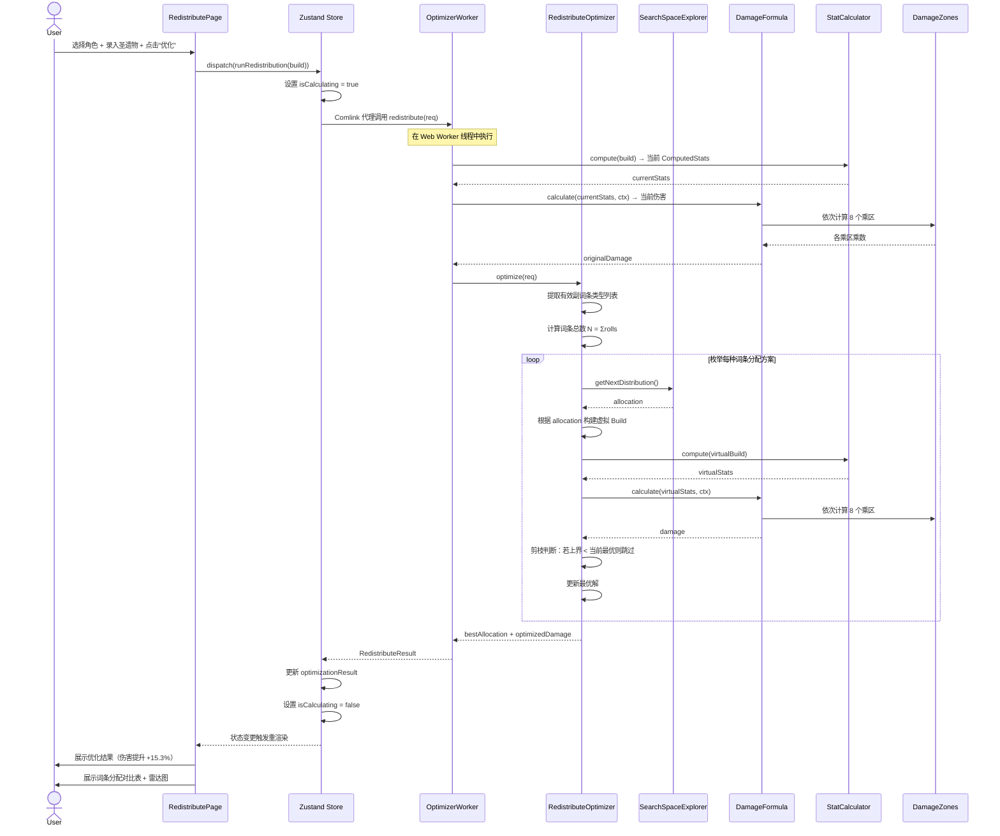
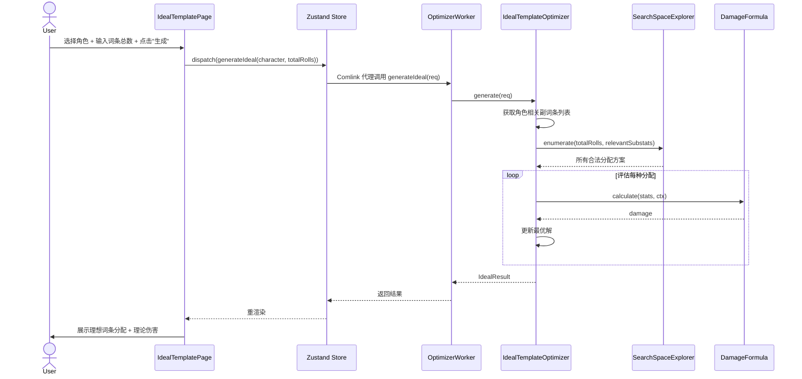
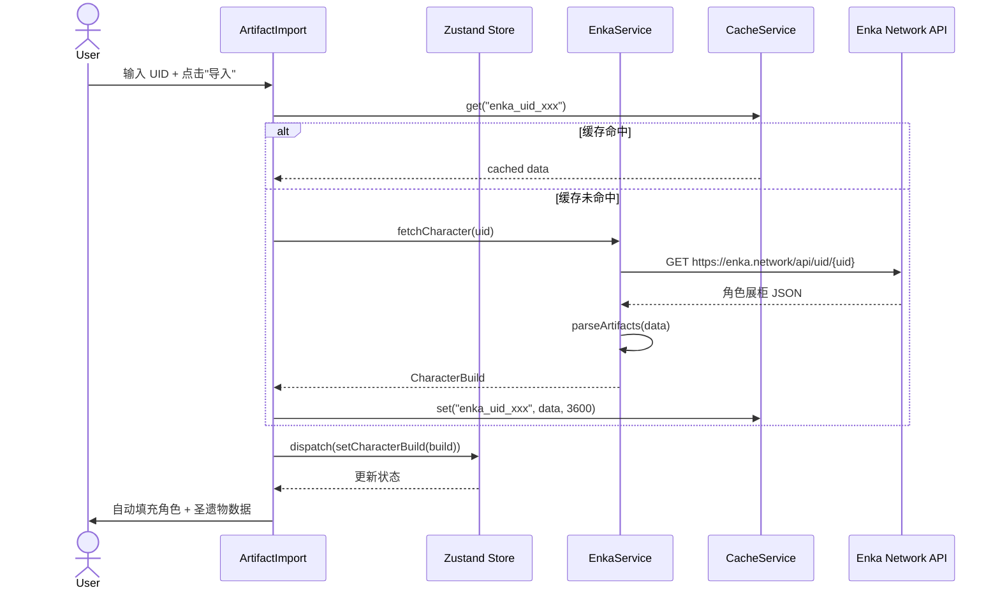
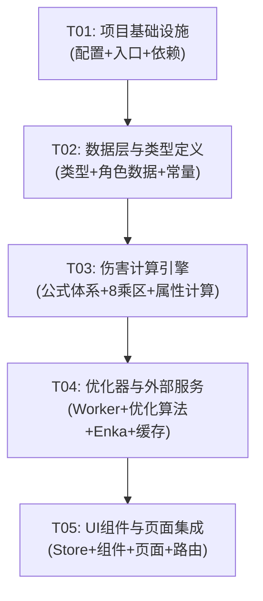

# 原神圣遗物词条优化器 — 系统架构设计文档

## 一、实现方案与框架选型

### 1.1 核心技术挑战

| 挑战 | 说明 | 解决方案 |
|---|---|---|
| 伤害公式体系复杂度 | 原神伤害公式包含 8 个乘区，各乘区计算逻辑差异大，且需支持基于生命值/防御力的伤害角色 | 采用乘区管道（Zone Pipeline）架构，每个乘区独立模块，通过统一的 `DamageZone` 接口组合 |
| 优化算法搜索空间 | 45 条词条分配到 5-7 种有效副词条，搜索空间约 C(49,4)≈21 万 到 C(51,6)≈1800 万 | 枚举剪枝 + 动态规划；预过滤无效副词条缩小维度；Web Worker 避免阻塞 |
| 角色数据可扩展性 | 需支持 80+ 角色，新角色频繁上线 | 数据驱动架构，角色数据存为 JSON 配置，代码逻辑与数据完全解耦 |
| Web Worker 集成 | 优化计算耗时可能数秒，必须不阻塞 UI | 使用 Comlink 库封装 Worker 通信，Zustand store 通过 async action 调用 |
| 圣遗物数据录入 | 用户需手动录入 5 件圣遗物各 4 条副词条，交互繁琐 | 提供 Enka API 自动导入 + 手动录入双入口；表单智能联动（主词条联动副词条可选项） |

### 1.2 框架与库选型

| 类别 | 选型 | 版本 | 理由 |
|---|---|---|---|
| 构建工具 | Vite | ^5.4.0 | 快速 HMR，原生 ESM，配置简洁 |
| UI 框架 | React | ^18.3.0 | 生态成熟，组件化开发，Hooks 简洁 |
| 组件库 | MUI | ^6.1.0 | 企业级组件质量，主题定制灵活，中文友好 |
| 样式方案 | Tailwind CSS | ^3.4.0 | 原子化 CSS，快速布局，与 MUI 互补 |
| 状态管理 | Zustand | ^5.0.0 | 轻量无 boilerplate，支持 async action，天然适配 Worker 调用 |
| 路由 | React Router | ^6.26.0 | 声明式路由，数据加载 API |
| 图表 | Recharts | ^2.12.0 | React 原生，雷达图/条形图开箱即用 |
| Worker 通信 | Comlink | ^4.4.0 | 将 Worker 封装为 Promise 化的代理对象，消除 postMessage 样板代码 |
| 开发语言 | TypeScript | ^5.5.0 | 类型安全，接口约束，重构友好 |

### 1.3 架构模式

采用 **模块化管道架构（Modular Pipeline Architecture）**：

```
┌──────────────────────────────────────────────────────────────────┐
│                        UI Layer (React)                          │
│  ┌──────────┐  ┌──────────────┐  ┌───────────────┐             │
│  │ 重分配页面 │  │ 理想模板页面  │  │  公共组件层    │             │
│  └─────┬─────┘  └──────┬───────┘  └───────┬───────┘             │
│        └────────────────┼──────────────────┘                     │
│                         │                                        │
│  ┌──────────────────────▼──────────────────────────┐            │
│  │              Zustand Store (状态管理)              │            │
│  └──────────────────────┬──────────────────────────┘            │
├─────────────────────────┼────────────────────────────────────────┤
│                    Service Layer                                   │
│  ┌──────────────┐  ┌───▼───┐  ┌──────────────┐                  │
│  │ EnkaService  │  │ Store │  │ CacheService │                  │
│  └──────────────┘  └───┬───┘  └──────────────┘                  │
│                       │                                           │
├───────────────────────┼───────────────────────────────────────────┤
│                  Engine Layer (纯函数)                              │
│  ┌────────────────────▼──────────────────────┐                   │
│  │         DamageFormula (伤害公式管道)         │                   │
│  │  ┌──────┐ ┌────────┐ ┌──────┐ ┌──────┐   │                   │
│  │  │基础区│→│倍率区   │→│增伤区│→│暴击区│   │                   │
│  │  └──────┘ └────────┘ └──────┘ └──────┘   │                   │
│  │  ┌──────┐ ┌────────┐ ┌──────┐             │                   │
│  │  │抗性区│→│防御区   │→│反应区│             │                   │
│  │  └──────┘ └────────┘ └──────┘             │                   │
│  └────────────────────────────────────────────┘                   │
│                                                                    │
│  ┌────────────────────────────────────────────┐                   │
│  │          Optimizer (Web Worker)             │                   │
│  │  ┌──────────────┐  ┌──────────────────┐    │                   │
│  │  │ 重分配优化器  │  │ 理想模板优化器    │    │                   │
│  │  └──────┬───────┘  └────────┬─────────┘    │                   │
│  │         └────────┬──────────┘               │                   │
│  │           ┌──────▼──────┐                   │                   │
│  │           │ 搜索空间枚举 │                   │                   │
│  │           │  + 剪枝策略  │                   │                   │
│  │           └─────────────┘                   │                   │
│  └────────────────────────────────────────────┘                   │
├────────────────────────────────────────────────────────────────────┤
│                    Data Layer (JSON 配置)                           │
│  ┌───────────┐  ┌───────────┐  ┌─────────────┐                   │
│  │ 角色数据   │  │ 武器数据   │  │ 常量/配置    │                   │
│  └───────────┘  └───────────┘  └─────────────┘                   │
└────────────────────────────────────────────────────────────────────┘
```

**关键设计决策：**
- **伤害公式 = 纯函数管道**：`DamageFormula.calculate(context) => result`，无副作用，易测试
- **优化器 = Web Worker 独立线程**：通过 Comlink 暴露 API，主线程无感知
- **数据 = JSON 配置驱动**：角色/武器数据纯 JSON，新增角色不改代码
- **副词条 = 固定中间值**：P0 阶段每种副词条类型取固定中间值（如暴击率每条 3.3%），简化优化为整数规划

---

## 二、文件列表及相对路径

```
genshin_artifact_optimizer/
├── index.html                                  # HTML 入口
├── package.json                                # 依赖声明
├── vite.config.ts                              # Vite 配置（含 Worker 配置）
├── tailwind.config.ts                          # Tailwind 配置
├── tsconfig.json                               # TypeScript 配置
├── tsconfig.node.json                          # Node 端 TS 配置
├── postcss.config.js                           # PostCSS 配置
├── public/
│   └── favicon.ico                             # 网站图标
├── src/
│   ├── main.tsx                                # React 入口
│   ├── App.tsx                                 # 根组件（路由 + 主题 + 布局）
│   ├── vite-env.d.ts                           # Vite 类型声明
│   │
│   ├── types/
│   │   └── index.ts                            # 全局 TypeScript 类型定义
│   │
│   ├── data/
│   │   ├── constants.ts                        # 游戏常量（副词条中间值、抗性表等）
│   │   ├── characters/
│   │   │   ├── index.ts                        # 角色数据索引 & 加载器
│   │   │   ├── hu_tao.json                     # 胡桃数据
│   │   │   ├── raiden_shogun.json              # 雷电将军数据
│   │   │   └── ...                             # 其他角色 JSON
│   │   ├── weapons.ts                          # 武器数据（P1）
│   │   └── artifact_sets.ts                    # 圣遗物套装数据（P2）
│   │
│   ├── engine/
│   │   ├── index.ts                            # 引擎统一导出
│   │   ├── stats.ts                            # 属性计算器（Build → ComputedStats）
│   │   ├── formula.ts                          # 伤害公式编排器
│   │   └── zones/
│   │       ├── index.ts                        # 乘区统一导出
│   │       ├── base.ts                         # 基础伤害区
│   │       ├── scaling.ts                      # 倍率区（含 HP/DEF 倍率）
│   │       ├── bonus.ts                        # 增伤区
│   │       ├── crit.ts                         # 暴击区
│   │       ├── resistance.ts                   # 抗性区
│   │       ├── defense.ts                      # 防御区
│   │       ├── amplifying.ts                   # 增幅反应区（蒸发/融化）
│   │       └── transformative.ts               # 剧变反应区（超载/感电等）
│   │
│   ├── optimizer/
│   │   ├── index.ts                            # 优化器统一导出
│   │   ├── worker.ts                           # Web Worker 入口（Comlink 暴露）
│   │   ├── redistribute.ts                     # 词条重分配优化器
│   │   ├── ideal.ts                            # 理想词条模板生成器
│   │   └── search.ts                           # 搜索空间枚举 + 剪枝策略
│   │
│   ├── services/
│   │   ├── enka.ts                             # Enka Network API 客户端
│   │   └── cache.ts                            # localStorage 缓存服务
│   │
│   ├── store/
│   │   ├── index.ts                            # Zustand store 创建
│   │   └── slices/
│   │       ├── characterSlice.ts               # 角色相关状态
│   │       ├── artifactSlice.ts                # 圣遗物相关状态
│   │       └── optimizerSlice.ts               # 优化器状态 & Worker 调用
│   │
│   ├── components/
│   │   ├── layout/
│   │   │   ├── AppLayout.tsx                   # 整体布局（侧边栏 + 内容区）
│   │   │   └── Sidebar.tsx                     # 左侧导航栏
│   │   ├── common/
│   │   │   ├── StatInput.tsx                   # 属性输入组件
│   │   │   ├── StatDisplay.tsx                 # 属性展示组件
│   │   │   ├── DamageResult.tsx                # 伤害结果展示
│   │   │   └── LoadingOverlay.tsx              # 计算中遮罩
│   │   ├── character/
│   │   │   ├── CharacterSelect.tsx             # 角色选择器（搜索 + 下拉）
│   │   │   ├── CharacterStats.tsx              # 角色属性面板
│   │   │   └── SkillInput.tsx                  # 技能倍率输入
│   │   ├── artifact/
│   │   │   ├── ArtifactEditor.tsx              # 手动录入圣遗物表单
│   │   │   ├── ArtifactImport.tsx              # Enka 自动导入
│   │   │   └── ArtifactList.tsx                # 圣遗物列表展示
│   │   ├── optimizer/
│   │   │   ├── RedistributePage.tsx            # 词条重分配优化页面
│   │   │   ├── IdealTemplatePage.tsx           # 理想词条模板页面
│   │   │   ├── OptimizationResult.tsx          # 优化结果展示
│   │   │   └── ComparisonChart.tsx             # 对比图表（雷达/条形）
│   │   └── weapon/
│   │       └── WeaponSelect.tsx                # 武器选择器（P1）
│   │
│   └── utils/
│       ├── format.ts                           # 数字格式化（百分比、千分位）
│       └── helper.ts                           # 通用工具函数
```

---

## 三、数据结构和接口（类图）

```mermaid
classDiagram
    direction TB

    %% ===== 枚举类型 =====
    class SubstatType {
        <<enumeration>>
        ATK_PERCENT
        ATK_FLAT
        HP_PERCENT
        HP_FLAT
        DEF_PERCENT
        DEF_FLAT
        CRIT_RATE
        CRIT_DMG
        ELEMENTAL_MASTERY
        ENERGY_RECHARGE
    }

    class ElementType {
        <<enumeration>>
        PYRO HYDRO CRYO ELECTRO
        ANEMO GEO DENDRO
    }

    class ArtifactSlotType {
        <<enumeration>>
        FLOWER FEATHER SANDS GOBLET CIRCLET
    }

    class ReactionType {
        <<enumeration>>
        NONE VAPORIZE MELT
        OVERLOADED SUPERCONDUCT ELECTRO_CHARGED
        SWIRL HYPERBLOOM BLOOM BURGEON
    }

    class ScalingType {
        <<enumeration>>
        ATK HP DEF
    }

    %% ===== 数据模型 =====
    class CharacterData {
        +string id
        +string name
        +string element~ElementType~
        +string weaponType
        +BaseStats baseStats
        +AscensionStat ascensionStat
        +SubstatType[] relevantSubstats
    }

    class BaseStats {
        +number hp
        +number atk
        +number def
        +number critRate
        +number critDmg
        +number em
        +number er
    }

    class AscensionStat {
        +SubstatType type
        +number[] values~按突破等级索引~
    }

    class WeaponData {
        +string id
        +string name
        +number rarity
        +number baseAtk
        +SubstatType substatType
        +number substatValue
        +string passiveDesc
    }

    class ArtifactInstance {
        +string id
        +ArtifactSlotType slot
        +SubstatType mainStatType
        +number mainStatValue
        +SubStatEntry[] subStats
        +string setName
    }

    class SubStatEntry {
        +SubstatType type
        +number value
    }

    class SubstatAllocation {
        +SubstatType type
        +number rolls~词条条数~
    }

    %% ===== 构建与属性计算 =====
    class CharacterBuild {
        +CharacterData character
        +WeaponData weapon
        +ArtifactInstance[] artifacts~长度5~
        +number characterLevel
        +number weaponLevel
        +number skillMultiplier
        +ReactionType reactionType
        +TeamBuff[] teamBuffs
        +toDamageContext() DamageContext
    }

    class ComputedStats {
        +number totalHp
        +number totalAtk
        +number totalDef
        +number critRate
        +number critDmg
        +number dmgBonus
        +number em
        +number er
    }

    class DamageContext {
        +ComputedStats stats
        +number skillMultiplier
        +ScalingType scalingType
        +ReactionType reactionType
        +number enemyLevel
        +number enemyResistance
        +number amplifyingMultiplier
    }

    %% ===== 伤害公式引擎 =====
    class DamageFormula {
        +calculate~ctx: DamageContext~ DamageResult$
    }

    class DamageZone {
        <<abstract>>
        +calculate~ctx: DamageContext~ number*
        +getName() string*
    }

    class BaseDamageZone {
        +calculate~ctx: DamageContext~ number
    }
    class ScalingZone {
        +calculate~ctx: DamageContext~ number
    }
    class BonusZone {
        +calculate~ctx: DamageContext~ number
    }
    class CritZone {
        +calculate~ctx: DamageContext~ number
    }
    class ResistanceZone {
        +calculate~ctx: DamageContext~ number
    }
    class DefenseZone {
        +calculate~ctx: DamageContext~ number
    }
    class AmplifyingZone {
        +calculate~ctx: DamageContext~ number
    }
    class TransformativeZone {
        +calculate~ctx: DamageContext~ number
    }

    DamageZone <|-- BaseDamageZone
    DamageZone <|-- ScalingZone
    DamageZone <|-- BonusZone
    DamageZone <|-- CritZone
    DamageZone <|-- ResistanceZone
    DamageZone <|-- DefenseZone
    DamageZone <|-- AmplifyingZone
    DamageZone <|-- TransformativeZone

    DamageFormula --> DamageZone : uses 8 zones

    class DamageResult {
        +number totalDamage
        +number baseDamage
        +number scalingMultiplier
        +number bonusMultiplier
        +number critMultiplier
        +number resistanceMultiplier
        +number defenseMultiplier
        +number reactionMultiplier
    }

    %% ===== 属性计算器 =====
    class StatCalculator {
        +compute~build: CharacterBuild~ ComputedStats$
    }

    StatCalculator --> CharacterBuild : reads
    StatCalculator --> ComputedStats : produces

    %% ===== 优化器 =====
    class OptimizerWorker {
        +redistribute~req: RedistributeRequest~ RedistributeResult
        +generateIdeal~req: IdealRequest~ IdealResult
    }

    class RedistributeOptimizer {
        +optimize~req: RedistributeRequest~ RedistributeResult
        -enumerateDistributions~total, types~ SubstatAllocation[][]
        -evaluateDamage~alloc, ctx~ number
    }

    class IdealTemplateOptimizer {
        +generate~req: IdealRequest~ IdealResult
    }

    class SearchSpaceExplorer {
        +enumerate~total: number, types: SubstatType[]~ SubstatAllocation[][]
        +prune~branches, bestDamage~ SubstatAllocation[][]
    }

    OptimizerWorker --> RedistributeOptimizer
    OptimizerWorker --> IdealTemplateOptimizer
    RedistributeOptimizer --> SearchSpaceExplorer
    IdealTemplateOptimizer --> SearchSpaceExplorer
    RedistributeOptimizer --> DamageFormula
    IdealTemplateOptimizer --> DamageFormula

    %% ===== 请求/响应 =====
    class RedistributeRequest {
        +CharacterBuild build
        +SubstatAllocation[] currentAllocations
    }

    class RedistributeResult {
        +number originalDamage
        +number optimizedDamage
        +number improvementPercent
        +SubstatAllocation[] optimizedAllocations
    }

    class IdealRequest {
        +CharacterData character
        +number totalRolls
        +number skillMultiplier
        +ReactionType reactionType
    }

    class IdealResult {
        +number theoreticalDamage
        +SubstatAllocation[] idealAllocations
    }

    %% ===== 服务层 =====
    class EnkaService {
        +fetchCharacter~uid: string, charIdx: number~ CharacterBuild
        -parseArtifacts~data~ ArtifactInstance[]
    }

    class CacheService {
        +get~key: string~ T
        +set~key: string, value: T, ttl: number~ void
        +clear~key: string~ void
    }

    %% ===== 关系 =====
    CharacterBuild --> CharacterData
    CharacterBuild --> WeaponData
    CharacterBuild --> ArtifactInstance
    CharacterData --> BaseStats
    CharacterData --> AscensionStat
    ArtifactInstance --> SubStatEntry
    ArtifactInstance --> ArtifactSlotType
    SubStatEntry --> SubstatType
    SubstatAllocation --> SubstatType
    DamageFormula --> DamageContext
    DamageContext --> ComputedStats
    RedistributeRequest --> CharacterBuild
    RedistributeResult --> SubstatAllocation
    IdealRequest --> CharacterData
    IdealResult --> SubstatAllocation
```



---

## 四、程序调用流程（时序图）

### 4.1 词条重分配优化核心流程



### 4.2 理想词条模板生成流程



### 4.3 Enka 自动导入流程



---

## 五、任务列表

### Task 01: 项目基础设施

- **依赖**: 无
- **优先级**: P0
- **文件**:
  - `package.json`
  - `vite.config.ts`
  - `tsconfig.json`
  - `tsconfig.node.json`
  - `tailwind.config.ts`
  - `postcss.config.js`
  - `index.html`
  - `public/favicon.ico`
  - `src/main.tsx`
  - `src/App.tsx`
  - `src/vite-env.d.ts`
- **描述**:
  - 初始化 Vite + React + TypeScript 项目
  - 配置 MUI 主题（中文默认字体、原神风格配色方案）
  - 配置 Tailwind CSS 与 MUI 共存（CSS 前缀避免冲突）
  - 配置 Vite 对 Web Worker 的构建支持（`new Worker(new URL(...), { type: 'module' })`）
  - 搭建 `App.tsx` 基础框架：React Router 路由配置、MUI ThemeProvider、Zustand Provider
  - 创建基础路由结构：首页 `/`、词条重分配 `/redistribute`、理想模板 `/ideal`

### Task 02: 数据层与类型定义

- **依赖**: Task 01
- **优先级**: P0
- **文件**:
  - `src/types/index.ts`
  - `src/data/constants.ts`
  - `src/data/characters/index.ts`
  - `src/data/characters/hu_tao.json`
  - `src/data/characters/raiden_shogun.json`
  - `src/data/characters/zhong_li.json`
  - `src/data/characters/raiden_shogun.json`
  - `src/data/characters/navilette.json`
  - `src/data/weapons.ts`
  - `src/data/artifact_sets.ts`
  - `src/utils/format.ts`
  - `src/utils/helper.ts`
- **描述**:
  - 定义全部 TypeScript 类型和接口（见类图中的所有类型）
  - 实现游戏常量：副词条中间值映射表（每条暴击率 3.3%、暴击伤害 6.6%、攻击力% 5.0% 等）、抗性表、防御公式常量
  - 创建角色数据索引加载器，支持 `import.meta.glob` 动态导入角色 JSON
  - 编写至少 5 个代表性角色的完整数据 JSON（胡桃-HP 倍率、雷电将军-充能、钟离-DEF、那维莱特-HP、甘雨-双冰暴击）
  - 武器数据骨架（P1 阶段填充具体数据）
  - 圣遗物套装数据骨架（P2 阶段填充）
  - 数字格式化工具（百分比、千分位、伤害数值）

### Task 03: 伤害计算引擎

- **依赖**: Task 02
- **优先级**: P0
- **文件**:
  - `src/engine/index.ts`
  - `src/engine/stats.ts`
  - `src/engine/formula.ts`
  - `src/engine/zones/index.ts`
  - `src/engine/zones/base.ts`
  - `src/engine/zones/scaling.ts`
  - `src/engine/zones/bonus.ts`
  - `src/engine/zones/crit.ts`
  - `src/engine/zones/resistance.ts`
  - `src/engine/zones/defense.ts`
  - `src/engine/zones/amplifying.ts`
  - `src/engine/zones/transformative.ts`
- **描述**:
  - **StatCalculator**：从 CharacterBuild 计算最终 ComputedStats，处理基础属性 + 突破属性 + 圣遗物主词条 + 副词条 + 武器副词条的叠加
  - **DamageFormula**：编排 8 个乘区的计算管道，输出 DamageResult（含各乘区明细）
  - **BaseDamageZone**：基础伤害 = 技能倍率 × 对应属性值（ATK / HP / DEF，由 ScalingType 决定）
  - **ScalingZone**：倍率区，根据角色伤害类型选择 ATK% / HP% / DEF% 作为缩放属性
  - **BonusZone**：增伤区 = 1 + 元素伤害加成 + 其他伤害加成
  - **CritZone**：暴击区 = 1 + 暴击率 × 暴击伤害（暴击率上限 100%）
  - **ResistanceZone**：抗性区，根据敌人抗性分段计算（<0 / 0~75% / >75% 三段公式）
  - **DefenseZone**：防御区 = (角色等级 + 100) / ((角色等级 + 100) + (敌防 × (1 - 降防比例)) )
  - **AmplifyingZone**：增幅反应区 = 反应倍率 × (1 + 精通加成)，蒸发 1.5/2.0，融化 1.5/2.0
  - **TransformativeZone**：剧变反应区 = 基础伤害 × (1 + 精通加成 + 其他加成) × 抗性区
  - 每个乘区编写单元测试验证公式正确性（对比社区已验证的伤害计算器）

### Task 04: 优化器与外部服务

- **依赖**: Task 03
- **优先级**: P0
- **文件**:
  - `src/optimizer/index.ts`
  - `src/optimizer/worker.ts`
  - `src/optimizer/redistribute.ts`
  - `src/optimizer/ideal.ts`
  - `src/optimizer/search.ts`
  - `src/services/enka.ts`
  - `src/services/cache.ts`
- **描述**:
  - **SearchSpaceExplorer**：枚举 N 个词条分配到 K 种副词条的所有合法组合
    - 使用递归枚举 + 字典序剪枝
    - 实现上界估计函数：基于拉格朗日松弛估计剩余分配的最大伤害上界，用于剪枝
    - 预过滤：只枚举角色 relevantSubstats 中的副词条类型
  - **RedistributeOptimizer**：
    - 输入当前 Build + 当前词条分配
    - 计算词条总数 N = Σ(currentAllocations.rolls)
    - 调用 SearchSpaceExplorer 枚举分配方案
    - 对每种方案构建虚拟 Build 并调用 DamageFormula 评估
    - 返回最优方案 + 伤害提升百分比
  - **IdealTemplateOptimizer**：
    - 输入角色 + 词条总数 N
    - 同样枚举 + 评估，返回理论最优分配
  - **OptimizerWorker**：
    - 使用 Comlink 暴露 `redistribute()` 和 `generateIdeal()` 方法
    - Worker 内部导入 engine 和 optimizer 模块
    - 支持进度回调（通过 Comlink 的 callback proxy）
  - **EnkaService**：
    - 封装 Enka Network API 调用（`GET /api/uid/{uid}`）
    - 解析返回的 JSON 为 CharacterBuild 对象
    - 错误处理（UID 不存在、API 不可用、频率限制）
  - **CacheService**：
    - 基于 localStorage 的 TTL 缓存
    - 用于缓存 Enka 数据和优化结果

### Task 05: UI 组件与页面集成

- **依赖**: Task 04
- **优先级**: P0
- **文件**:
  - `src/store/index.ts`
  - `src/store/slices/characterSlice.ts`
  - `src/store/slices/artifactSlice.ts`
  - `src/store/slices/optimizerSlice.ts`
  - `src/components/layout/AppLayout.tsx`
  - `src/components/layout/Sidebar.tsx`
  - `src/components/common/StatInput.tsx`
  - `src/components/common/StatDisplay.tsx`
  - `src/components/common/DamageResult.tsx`
  - `src/components/common/LoadingOverlay.tsx`
  - `src/components/character/CharacterSelect.tsx`
  - `src/components/character/CharacterStats.tsx`
  - `src/components/character/SkillInput.tsx`
  - `src/components/artifact/ArtifactEditor.tsx`
  - `src/components/artifact/ArtifactImport.tsx`
  - `src/components/artifact/ArtifactList.tsx`
  - `src/components/optimizer/RedistributePage.tsx`
  - `src/components/optimizer/IdealTemplatePage.tsx`
  - `src/components/optimizer/OptimizationResult.tsx`
  - `src/components/optimizer/ComparisonChart.tsx`
  - `src/components/weapon/WeaponSelect.tsx`
- **描述**:
  - **Zustand Store**：
    - `characterSlice`：当前选中角色、角色等级、技能倍率、队伍配置
    - `artifactSlice`：5 件圣遗物实例数据、Enka 导入状态
    - `optimizerSlice`：优化结果、计算中状态、Worker 实例管理
  - **布局组件**：AppLayout（侧边栏 + 内容区 + 顶部标题栏）、Sidebar（导航菜单 + 原神风格图标）
  - **公共组件**：StatInput（属性输入 + 下拉选择 + 数值输入）、StatDisplay（属性名 + 数值展示）、DamageResult（大字伤害数字 + 提升百分比）、LoadingOverlay（Web Worker 计算时的遮罩动画）
  - **角色组件**：CharacterSelect（搜索过滤 + 元素图标 + 角色名下拉）、CharacterStats（属性汇总面板）、SkillInput（倍率输入 + 反应类型选择）
  - **圣遗物组件**：ArtifactEditor（5 件圣遗物表单、主词条联动、副词条类型过滤）、ArtifactImport（UID 输入 + 角色选择 + 导入按钮）、ArtifactList（圣遗物卡片列表）
  - **优化器组件**：RedistributePage（完整重分配页面，组合角色+圣遗物+优化结果）、IdealTemplatePage（理想模板页面）、OptimizationResult（词条分配对比表 + 伤害提升百分比）、ComparisonChart（Recharts 雷达图/条形图）
  - **武器选择器**（P1 骨架）：WeaponSelect 下拉组件

---

## 六、依赖包列表

```
# 核心框架
- react@^18.3.1: UI 框架
- react-dom@^18.3.1: React DOM 渲染
- typescript@^5.5.4: 类型系统

# 构建工具
- vite@^5.4.2: 构建工具
- @vitejs/plugin-react@^4.3.1: Vite React 插件

# UI 库
- @mui/material@^6.1.0: MUI 组件库
- @mui/icons-material@^6.1.0: MUI 图标库
- @emotion/react@^11.13.0: CSS-in-JS 引擎（MUI 依赖）
- @emotion/styled@^11.13.0: styled API（MUI 依赖）

# 样式
- tailwindcss@^3.4.10: 原子化 CSS
- postcss@^8.4.41: CSS 处理器
- autoprefixer@^10.4.20: CSS 自动前缀

# 状态 & 路由
- zustand@^5.0.0: 轻量状态管理
- react-router-dom@^6.26.2: 客户端路由

# 图表
- recharts@^2.12.7: 数据可视化（雷达图/条形图）

# Web Worker
- comlink@^4.4.1: Web Worker 通信封装

# 开发依赖
- @types/react@^18.3.5: React 类型定义
- @types/react-dom@^18.3.0: React DOM 类型定义
- eslint@^9.9.0: 代码检查
- @typescript-eslint/eslint-plugin@^8.3.0: TS ESLint 插件
```

---

## 七、共享知识

### 7.1 伤害公式约定

```
最终伤害 = 基础伤害区 × 增伤区 × 暴击区 × 抗性区 × 防御区 × 反应区
```

- **基础伤害区** = 技能倍率 × 缩放属性值（ATK / HP / DEF）
- **增伤区** = 1 + 元素伤害加成% + 其他伤害加成%
- **暴击区** = 1 + min(暴击率, 1) × 暴击伤害%
- **抗性区** = 
  - 若 抗性 < 0: 1 - 抗性 / 2
  - 若 0 ≤ 抗性 < 0.75: 1 - 抗性
  - 若 抗性 ≥ 0.75: 1 / (1 + 4 × 抗性)
- **防御区** = (角色等级 + 100) / ((角色等级 + 100) + (敌方等级 + 100) × (1 - 降防比例) × (1 + 防御提升比例))
- **反应区（增幅）** = 反应倍率 × (1 + 精通提升 + 其他反应加成)
- **反应区（剧变）** = 等级基础伤害 × (1 + 精通提升 + 其他加成) × 抗性区

### 7.2 副词条中间值（P0 阶段固定值）

| 副词条类型 | 每条中间值 | 备注 |
|---|---|---|
| 暴击率 | 3.3% | 范围 2.7%-3.9% |
| 暴击伤害 | 6.6% | 范围 5.4%-7.8% |
| 攻击力% | 5.0% | 范围 4.1%-5.8% |
| 生命值% | 5.0% | 范围 4.1%-5.8% |
| 防御力% | 6.2% | 范围 5.1%-7.3% |
| 元素精通 | 19.8 | 范围 16-23 |
| 充能效率 | 5.5% | 范围 4.5%-6.5% |
| 攻击力（固定） | 18.0 | 范围 14-21 |
| 生命值（固定） | 268.5 | 范围 209-328 |
| 防御力（固定） | 21.4 | 范围 16-25 |

### 7.3 命名规范

- **文件命名**: 组件文件用 PascalCase（`ArtifactEditor.tsx`），工具/服务文件用 camelCase（`enka.ts`）
- **类型命名**: 接口用 PascalCase + 无 I 前缀（`CharacterData`），枚举用 PascalCase（`SubstatType`）
- **Store Slice**: 以 `use` + 名词 + `Store` 命名（`useCharacterStore`）
- **常量**: UPPER_SNAKE_CASE（`SUBSTAT_MID_VALUES`）
- **组件导出**: 默认导出组件，命名导出类型
- **副词条枚举值**: 全大写 + 下划线（`ATK_PERCENT`, `CRIT_RATE`）

### 7.4 数据格式约定

- 所有百分比内部存储为小数（如 50% → 0.5），仅在 UI 展示时转换为百分比格式
- 角色数据 JSON 文件按角色英文名命名（`hu_tao.json`），使用小写 + 下划线
- 伤害数值保留整数展示，百分比保留一位小数
- 所有属性计算使用浮点数，仅在最终展示时格式化

### 7.5 组件通信约定

- 跨页面状态通过 Zustand store 共享
- 组件内局部状态使用 React.useState
- Web Worker 通过 Comlink 代理对象调用，返回 Promise
- 优化进度通过 Comlink callback proxy 实时回传

---

## 八、任务依赖关系图



---

## 九、待明确事项

| 编号 | 事项 | 影响范围 | 当前假设 |
|---|---|---|---|
| U1 | 角色数据 JSON 的精确数值来源（基础 HP/ATK/DEF 各等级数值） | Task 02 | 参考 Genshin Wiki / Project Celestia 数据，手工录入 90 级数据 |
| U2 | 优化算法枚举剪枝的上界估计函数精确度是否足够 | Task 04 | 先实现基础枚举 + 简单剪枝，性能不足时再引入拉格朗日松弛上界 |
| U3 | Enka Network API 是否存在跨域限制（前端直接调用） | Task 04 | 假设可直接前端调用（Enka API 支持 CORS）；若有问题需加代理 |
| U4 | MUI v6 与 Tailwind CSS 的样式优先级冲突处理 | Task 01 | 通过 Tailwind `important` 选项 + MUI `sx` prop 优先级解决 |
| U5 | 5 件圣遗物的词条总数合理范围（用于输入校验） | Task 02 | 0-45 条（5 件 × 4 副词条 + 强化次数） |
| U6 | 增幅反应的精通提升公式中"其他反应加成"是否需在 P0 支持 | Task 03 | P0 仅支持基础精通公式，其他加成预留参数接口 |
